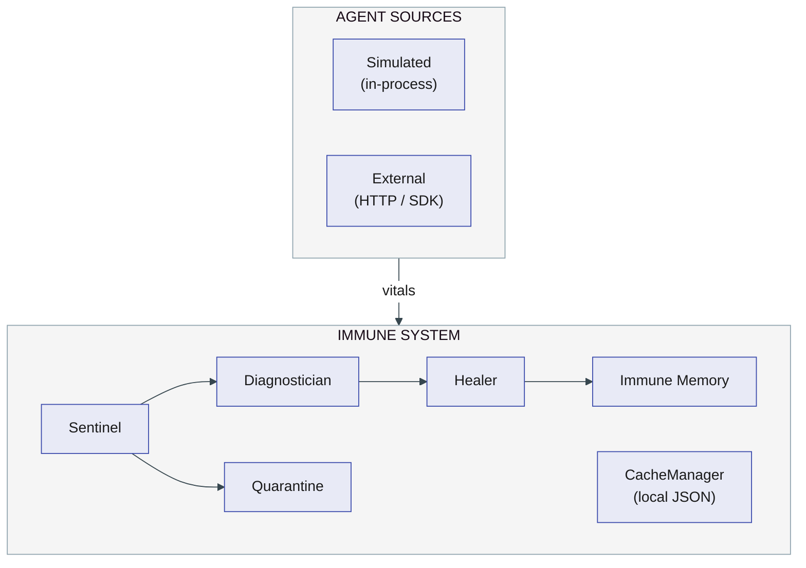

# AI Agent Immune System

The AI Agent Immune System is a **control plane** (a management layer that monitors and governs other systems) for autonomous AI agents. It continuously monitors their behavior, detects anomalies, quarantines unhealthy agents, and heals them using policy-driven actions with optional human-in-the-loop approval for high-deviation cases.

The system learns per-agent baselines, correlates anomalies into diagnoses, and maintains an immune memory so that failed healing actions are not repeated—improving stability and reducing operator load as the number of agents scales.

> **Viewing diagrams:** This repo uses [Mermaid](https://mermaid.js.org/) diagrams. They render natively on **GitHub**. In **VS Code / Cursor**, install the [Markdown Preview Mermaid Support](https://marketplace.visualstudio.com/items?itemName=bierner.markdown-mermaid) extension (`bierner.markdown-mermaid`), then preview with `Cmd+Shift+V` (macOS) or `Ctrl+Shift+V` (Windows/Linux).

---

## Product Overview

### Problem

Autonomous AI agents (e.g. those backed by models like GPT-5 or Claude and tools exposed via MCP — Model Context Protocol) can exhibit unhealthy behavior: prompt drift, token explosions, tool-call loops, latency spikes, or high retry rates. Without a structured response, such behavior can cascade, and manual intervention does not scale.

### Approach

The system treats agents as managed entities with an *immune system*:

- **Baseline learning:** Each agent's normal behavior (latency, tokens, input/output tokens, cost, tool calls, retries, prompt hash) is learned from **vitals** (health metrics emitted after each task, analogous to a patient's vital signs) so that anomalies are judged relative to that agent, not a single global threshold.
- **Anomaly detection:** A sentinel compares recent vitals to the baseline and flags infections with a deviation score (in σ — standard deviations from normal baseline). Anomaly types: token spike, latency spike, tool explosion, high retry rate, input/output token spike, cost spike, prompt change, error rate spike.
- **Containment:** Infected agents are quarantined immediately so they no longer affect the rest of the system.
- **Human-in-the-loop for severe cases:** Infections above a configurable deviation threshold (default 5.0σ) require explicit Approve or Reject in the web dashboard before healing runs. Rejected agents remain quarantined until an operator chooses "Heal now" (per agent or "Heal all").
- **Policy-driven healing:** For each diagnosis type (e.g. prompt drift, prompt injection, infinite loop, tool instability), a fixed *healing policy* defines an ordered list of actions (e.g. reset memory, rollback prompt, reduce autonomy, revoke tools, reset agent). The healer tries actions in order; immune memory records successes and failures and skips actions that have already failed for that agent and diagnosis.
- **Restart resilience:** A local cache (`CacheManager`) persists EWMA (Exponential Weighted Moving Average) baselines, quarantine state, run identity, and API key across restarts — no cold-start delay (the period after restart where the system has to re-learn baselines before it can detect anomalies) or state loss.
- **Adaptive learning:** Immune memory is used across the fleet so the system converges toward actions that work and avoids repeating known failures.

The web dashboard provides a single pane of glass: agent status (with model and MCP labels), pending and rejected approvals, bulk actions (Approve all, Reject all, Heal all), recent healing actions, and learned patterns.

### Added capabilities

- **External agent integration:** Real AI agents (any language) can report vitals via `POST /api/v1/ingest`. Python agents can use the lightweight `immune_sdk.py` (`ImmuneReporter`) which wraps the HTTP API. Unknown agents are auto-registered on first report. See `docs/DOCS.md` §2.6.
- **Server API store (optional):** When `SERVER_API_BASE_URL` is set, the client uses **ApiStore** and talks to a server REST API for all persistence (client-deployed architecture). No direct InfluxDB on the client. See `docs/DOCS.md` (§2, §5, §6).
- **InfluxDB-backed persistence (optional):** InfluxDB is a time-series database well-suited for storing metrics over time. When `INFLUXDB_*` environment variables are set (and server API is not), telemetry, baselines, approval workflow state (pending/rejected), immune memory, and the healing action log are stored in InfluxDB. Each run is isolated by a `run_id`. If neither server API nor InfluxDB is configured, the system falls back to in-memory state.
- **OpenTelemetry (OTEL) metrics export:** When `OTEL_EXPORTER_OTLP_ENDPOINT` is set, the app exports metrics (counters, histograms) for agent executions, infections, approvals, and quarantine events to an OTLP HTTP endpoint (e.g. an OpenTelemetry Collector). OTEL is the metric *export* format; the primary vitals flow is agents → TelemetryCollector → store.
- **Structured logging:** Configurable via `LOG_LEVEL` and `LOG_FORMAT` (human-readable colored console or JSON for log aggregation). See `logging_config.py`.
- **Observability stack:** The `observability/` directory provides a Docker Compose stack (InfluxDB + OTEL Collector) for local demos and development.
- **Demo entry point:** `demo.py` runs a shorter demo (10 agents, default 600s run duration) with the same InfluxDB/OTEL setup as `main.py`; run length is configurable via `RUN_DURATION_SECONDS`.
- **Restart-resilient cache:** `CacheManager` (`immune_system/cache.py`) persists EWMA baselines, quarantine set, `run_id`, and ingest API key in a local JSON file (`~/.immune_cache/state.json`). On restart, the system resumes without cold-start baseline warmup or quarantine state loss.
- **Start script:** `start.sh` sets environment variables and launches `main.py` in one step.

---

## Use Cases in Real Environments

The AI Agent Immune System is designed for environments where many autonomous or agentic AI workloads run on shared infrastructure. Operators need to detect misbehavior early, contain impact, and restore agents without scaling manual intervention linearly with fleet size.

### Example: Cisco AI PODs and agentic AI

**Cisco AI PODs** are pre-validated, modular AI infrastructure (Cisco UCS compute, Nexus networking, NVIDIA AI Enterprise, Red Hat OpenShift, Intersight, and partners) used for the full AI lifecycle: training, fine-tuning, RAG pipelines, and **inference at scale**. Cisco's Secure AI Factory and related solutions explicitly target **agentic AI**—intelligent agents that automate tasks and interact autonomously with tools and data.

In such a setting, customers may run:

- **Inference agents** serving different models or use cases (e.g. support, analytics, code, networking).
- **Agentic workflows** that call tools (APIs, MCP servers, databases) and can drift, loop, or spike in tokens/latency.
- **RAG and retrieval agents** with distinct baselines for token and tool usage.

**How the immune system helps customers on Cisco AI PODs (and similar platforms):**

| Customer need | How the immune system addresses it |
|---------------|-------------------------------------|
| **Stability at scale** | Per-agent baselines and anomaly detection catch misbehavior (prompt drift, tool loops, latency spikes) before it affects more users or downstream systems. Quarantine limits blast radius. |
| **Controlled remediation** | Severe anomalies require approval before healing, so operators can review diagnosis and decide when to auto-heal vs. investigate or reject. Rejected agents stay quarantined until an explicit "Heal now," avoiding unwanted automatic actions. |
| **Reduced toil** | Immune memory learns which actions work for which diagnosis types and avoids repeating failed cures. As the fleet grows, healing success rate improves and repeat manual fixes decrease. |
| **Single pane of glass** | The dashboard shows all agents (with model/MCP context), pending and rejected approvals, and healing history. Approve all / Reject all / Heal all support bulk operations during incidents. |
| **Safe rollout of agentic AI** | New agent types or MCP integrations can be monitored with learned baselines; human-in-the-loop for high deviation keeps critical decisions under operator control while mild cases are healed automatically. |

This pattern applies beyond Cisco AI PODs: any deployment (on-prem, hybrid, or cloud) that runs multiple autonomous AI agents—whether on Kubernetes, OpenShift, or dedicated inference stacks—can use the immune system as an operational control plane for detection, containment, approval, and healing.

---

## High-Level Architecture

### System overview

High-level view: agents emit vitals into the immune system, which detects, diagnoses, contains, and recovers, with learning over time.



### Component architecture

This view shows the main components and how they connect (logical architecture). The Orchestrator coordinates the entire pipeline.


### Data flow

This view shows how data and control flow through the system (data flow diagram).


**Persistence:** Store (InfluxStore, ApiStore, or in-memory) for vitals, baselines, workflow state, action log. ApiStore = server REST API (no direct DB on client). Optional: OTEL metrics export when configured. See `docs/DOCS.md` §2.

---

## Coordination Between Components

### Concurrency model

- **Orchestrator** runs one asyncio event loop. It starts three concurrent logical flows:
  1. **Agent loops:** One async task per agent (`run_agent_loop(agent)`). Each task runs on a 1s tick: if the agent is not quarantined, it calls `agent.execute()`, records vitals with `TelemetryCollector`, and optionally triggers baseline learning when enough samples exist. If quarantined, the task sleeps for the tick interval and skips execution.
  2. **Sentinel loop:** One async task that, after an initial delay (to allow baselines to be learned), runs every 1s. It iterates over all agents, skips quarantined and no-baseline agents, and for the rest gets recent telemetry and runs `Sentinel.detect_infection(recent, baseline)`. If an infection is found, it quarantines the agent and either adds it to pending approvals (severe) or spawns a healing task (mild).
  3. **Chaos schedule (optional):** Injects failures into agents at fixed times for demos.

- **Web dashboard** runs in a separate thread (Flask). It holds a reference to the orchestrator's event loop. When the user Approves or chooses Heal now, the dashboard calls orchestrator methods (e.g. `approve_healing`, `start_healing_explicitly`) and, when healing must run, schedules `heal_agent(...)` on the main loop via `asyncio.run_coroutine_threadsafe(...)` so that healing runs in the same process as the agent and sentinel tasks, without blocking the HTTP server.

### Data flow

- **Telemetry:** Agent loops push vitals into `TelemetryCollector` (per-agent time-series). External agents push via `POST /api/v1/ingest` into the same collector. Baseline learner consumes these to compute mean/std per metric per agent. Sentinel and healer read from telemetry and baseline for detection and diagnosis.
- **Quarantine:** `QuarantineController` holds the set of quarantined agent IDs. Agent loops check it to skip execution; sentinel skips quarantined agents for re-detection; healing releases from quarantine on success.
- **Pending / rejected state:** When in-memory, severe infections are stored in `_pending_approvals` / `_rejected_approvals`; when a store is configured (InfluxStore or ApiStore), in the store. Dashboard reads this for the "Pending approvals" list. On Approve, the entry is removed and `heal_agent` is scheduled. On Reject, the entry is moved to `_rejected_approvals` and the agent stays quarantined. "Heal now" (single or all) removes from `_rejected_approvals` and schedules `heal_agent` for each. Sentinel does not re-add an agent to pending if the latest approval state is "rejected".
- **Healing:** `heal_agent(agent_id, infection, trigger)` is async: it diagnoses, loads the policy for that diagnosis type, filters by immune memory (skip previously failed actions for this agent+diagnosis), applies the next action, records the result in immune memory, and either releases the agent (success) or escalates to the next action (failure). All of this runs on the main asyncio loop; the dashboard only triggers it.

### Timing and alignment

- Agent tick and sentinel tick are both 1s (`TICK_INTERVAL_SECONDS`). The dashboard polls the backend every 1s. This keeps UI state aligned with backend state (e.g. "healing in progress" and runtime stats).
- Healing steps use a short delay (`HEALING_STEP_DELAY_SECONDS`) so that "healing in progress" is visible in the UI before the next action.

### Thread safety

- When using in-memory state, `_pending_approvals`, `_rejected_approvals`, and the healing action log are accessed from both the asyncio thread and the Flask thread; access is protected by a shared lock. When a store is configured (InfluxStore or ApiStore), workflow state is read/written via the store.

---

## Components (Reference)

| Component        | File              | Responsibility |
|-----------------|-------------------|----------------|
| Agent runtime   | `immune_system/agents.py` | Multiple agent types (Research, Data, Analytics, Coordinator); each executes on a tick and returns vitals; supports infection simulation and model/MCP-style labels for the UI. |
| Telemetry       | `immune_system/telemetry.py` | Stores vitals per agent; when a store is configured, uses it for persistence; otherwise in-memory; provides recent window and counts for baseline and sentinel; emits OTEL metrics for export. |
| Baseline        | `immune_system/baseline.py` | Learns EWMA (Exponential Weighted Moving Average) baselines per metric per agent after a minimum sample count (~15); persists state via cache for restart resilience. |
| Sentinel        | `immune_system/detection.py` | Compares recent vitals to baseline; emits infection report with anomaly types and deviation (σ). |
| Diagnostician   | `immune_system/diagnosis.py` | Maps anomaly patterns to diagnosis types (prompt drift, prompt injection, infinite loop, tool instability, memory corruption). |
| Healer          | `immune_system/healing.py` | Holds healing policies (diagnosis → ordered actions); applies actions (reset memory, rollback prompt, reduce autonomy, revoke tools, reset agent); consults immune memory to skip failed actions. |
| Immune memory   | `immune_system/memory.py` | Records per-agent, per-diagnosis healing outcomes; exposes failed actions and success-rate summaries; can persist via store when configured. |
| Quarantine      | `immune_system/quarantine.py` | Tracks quarantined agent IDs; quarantine/release used by orchestrator and agent loop. |
| Chaos           | `immune_system/chaos.py` | Injects token/tool/latency/retry-style failures for demos. |
| InfluxStore     | `immune_system/influx_store.py` | Optional InfluxDB-backed storage for vitals, baselines, infection/quarantine/approval events, healing memory, and action log; run-scoped by `run_id`. |
| ApiStore        | `immune_system/api_store.py` | Optional **server API**–backed store: same interface as InfluxStore but calls a remote REST API (used when immune system runs on client and server fronts InfluxDB). Set `SERVER_API_BASE_URL` to enable. |
| Cache           | `immune_system/cache.py` | Local JSON file cache for restart resilience: persists `run_id`, EWMA baselines, quarantine state, and API key across restarts. |
| Python SDK      | `immune_sdk.py` | Lightweight reporter for external Python agents; wraps `POST /api/v1/ingest` with auto-registration and API key auth. |
| Logging         | `immune_system/logging_config.py` | Structured logging: colored console or JSON format; configurable via `LOG_LEVEL` and `LOG_FORMAT`. |
| Orchestrator    | `immune_system/orchestrator.py` | Holds all of the above; runs agent loops, sentinel loop, and chaos schedule; implements approve/reject/heal-now and approve-all/reject-all/heal-all; exposes state and actions for the dashboard; uses store for workflow state when configured. |
| Web dashboard   | `immune_system/web_dashboard.py` | Flask app; serves UI and REST endpoints for status, agents, pending/rejected, healing log, stats; exposes `POST /api/v1/ingest` and `POST /api/v1/agents/register` for external agents; triggers healing on the orchestrator's event loop. |
| Entry point     | `main.py`, `demo.py` | `main.py`: full run (15 agents, default 1200s); `demo.py`: shorter run (10 agents, default 600s). Both support InfluxDB/OTEL and configure OTEL metrics when env vars are set. |
| Start script    | `start.sh` | Sets environment variables and launches `main.py`. |

---

## Setup and Run

### Basic (in-memory mode)

```bash
python3 -m venv venv
source venv/bin/activate   # Windows: venv\Scripts\activate
pip install -r requirements.txt
python main.py
```

Then open **http://localhost:8090** in a browser. The dashboard refreshes every second.

### With InfluxDB and OpenTelemetry (optional)

1. Start the observability stack (InfluxDB + OTEL Collector):

```bash
cd observability
docker compose up -d
```

2. Run the app with environment variables set (example for a short demo):

```bash
source venv/bin/activate
./start.sh
```

Or manually:

```bash
source venv/bin/activate
INFLUXDB_URL=http://localhost:8086 \
INFLUXDB_TOKEN=hackathon-influx-token-1234567890 \
INFLUXDB_ORG=appd \
INFLUXDB_BUCKET=immune_system \
OTEL_EXPORTER_OTLP_ENDPOINT=http://localhost:4318 \
OTEL_SERVICE_NAME=ai-agent-immune-system \
OTEL_METRIC_EXPORT_INTERVAL_MS=5000 \
RUN_DURATION_SECONDS=120 \
python demo.py
```

Use `RUN_DURATION_SECONDS=120` (or similar) for a short demo; `demo.py` defaults to 600s if unset. For a full run use `python main.py` (15 agents, default `RUN_DURATION_SECONDS=1200`). If InfluxDB or OTEL env vars are omitted, the app falls back to in-memory mode and skips metric export. See `docs/DOCS.md` §13 for detailed runbooks and health checks.

### Environment variables

| Variable | Purpose |
|----------|---------|
| `SERVER_API_BASE_URL` | When set, use **server API** store (client-deployed): client calls this base URL for all persistence. Optional: `SERVER_API_KEY`, `SERVER_RUN_ID`. See `docs/DOCS.md` §5. |
| `INFLUXDB_URL`, `INFLUXDB_TOKEN`, `INFLUXDB_ORG`, `INFLUXDB_BUCKET` | Enable direct InfluxDB-backed persistence (used if `SERVER_API_BASE_URL` is not set). Omit for in-memory mode. |
| `OTEL_EXPORTER_OTLP_ENDPOINT` | OTLP HTTP endpoint for metrics export (e.g. `http://localhost:4318`). If set, app exports OTEL metrics. |
| `OTEL_SERVICE_NAME` | Service name for OTEL resource (default: `ai-agent-immune-system`). |
| `OTEL_METRIC_EXPORT_INTERVAL_MS` | Metric export interval in ms (default: `5000`). |
| `RUN_DURATION_SECONDS` | How long the orchestrator runs. Default: `1200` for `main.py`, `600` for `demo.py`. |
| `LOG_LEVEL` | Logging level: `DEBUG`, `INFO`, `WARNING`, `ERROR`, `CRITICAL` (default: `INFO`). |
| `LOG_FORMAT` | `text` (colored console) or `json` for log aggregation (default: `text`). |
| `INGEST_API_KEY` | API key for `POST /api/v1/ingest` and `/api/v1/agents/register`. If not set, auto-generated and cached in `~/.immune_cache/state.json`. |
| `IMMUNE_CACHE_DIR` | Directory for the local state cache file. Defaults to `~/.immune_cache`. Set to a volume-mounted path in Docker/K8s. |

---

## Deployment Scenarios (Cache Persistence)

The local file cache (`~/.immune_cache/state.json`) stores run ID, EWMA baselines, quarantine list, and API key. How it persists depends on your deployment:

| Scenario | Cache survives? | Notes |
|---|---|---|
| Process restart on same host | Yes | File stays on disk. |
| Docker restart (same container) | Yes | Container filesystem persists across restarts. |
| Docker with volume mount | Yes | Set `IMMUNE_CACHE_DIR` to the mount path (e.g. `-v /data/immune-cache:/data/immune-cache -e IMMUNE_CACHE_DIR=/data/immune-cache`). |
| Kubernetes with PVC | Yes | Mount a PersistentVolumeClaim and set `IMMUNE_CACHE_DIR`. |
| Docker without volume / K8s without PVC | No (graceful degradation) | New `run_id` generated; baselines re-learned from store or from scratch; quarantine re-detected within one sentinel cycle (~1–2 s). |
| Blue/green deploy | No (graceful degradation) | Same as above — new instance starts fresh. |

When cache is lost, the system degrades gracefully: baselines are recovered from the store (InfluxDB/API) if available, or re-learned after `min_samples` (~15 samples). Quarantine state is the only thing truly lost; the sentinel re-detects anomalies within 1–2 seconds.

---

## Dashboard

- **Stats:** Total AI agents, executions, infections detected, healed count, success rate, runtime (wall-clock).
- **Pending approvals:** Severe infections awaiting a decision. Per-item Approve/Reject or **Approve all** / **Reject all**.
- **Rejected healings:** Agents that were rejected; **Heal now** per item or **Heal all**.
- **AI Agent Status Grid:** One card per agent (name, model, MCP servers, status). For pending agents: Approve/Reject on the card. For rejected: Heal now on the card.
- **Recent Healing Actions:** Timeline of approval requests, user approvals/rejections, Heal now, and healing attempts (with trigger: auto-healed, after approval, or Heal now).
- **Learned Healing Patterns:** Which diagnosis types responded best to which actions.

Sections are collapsible. All data is read from the orchestrator and refreshed every 1s.

---

## Behavior Summary

- **Deviation:** The primary anomaly signal is `max_deviation` (in σ — standard deviations from EWMA baseline). The UI displays deviation in σ (e.g. 5.2σ).
- **Severe infections:** When `max_deviation` is at or above a configurable threshold (default 5.0σ), the agent is quarantined and added to **pending approvals**. Healing does not start until a user Approves (or Approve all) in the dashboard.
- **Rejected:** If the user Rejects, the agent remains quarantined and is listed under **Rejected healings**. Healing can be started later via **Heal now** (single or Heal all).
- **Auto-heal:** When `max_deviation` is below the threshold, the orchestrator starts healing immediately using the diagnosis, policy ladder, and immune memory.
- **Healing policy:** Each diagnosis type has an ordered list of actions (e.g. reset memory, rollback prompt, reduce autonomy, revoke tools, reset agent). Immune memory skips actions that have already failed for that agent and diagnosis; the healer escalates to the next until success or exhaustion.

---

## Requirements

- Python 3.8+
- Dependencies (see `requirements.txt`): `flask`, `flask-cors` (dashboard); `requests` (for ApiStore and immune_sdk); `influxdb-client` (optional, for direct InfluxDB persistence); `opentelemetry-api`, `opentelemetry-sdk`, `opentelemetry-exporter-otlp` (optional, for metrics export).
- Optional: Docker and Docker Compose to run the observability stack in `observability/`.

---

## Further documentation

- **`docs/DOCS.md`** — **Single reference** for everything: executive summary, architecture (client-deployed), integration diagrams (Mermaid), internal design (HLD/LLD/Sequence), healing & deviation (§4), server REST API (§6), client config (§5), InfluxDB schema, alternative deployment, migration, security/SLOs, runtime notes, **operations runbook** (§13), **doc/code/test sync** (§15). Update this doc when anything changes.
- **`docs/PRODUCTION_READINESS.md`** — Production readiness analysis: architect and observability review, gaps (security, resilience, observability, packaging), and prioritized recommendations.
- **`tests/README.md`** — Test coverage vs DOCS scenarios; which tests cover ApiStore, dashboard, store-backed detection, run_id isolation, immune memory, and Heal now.
- **`presentation.py`** — Optional: generates a PowerPoint deck (requires `python-pptx`); not part of the runtime.

---

## License

See `LICENSE` in the repository.
