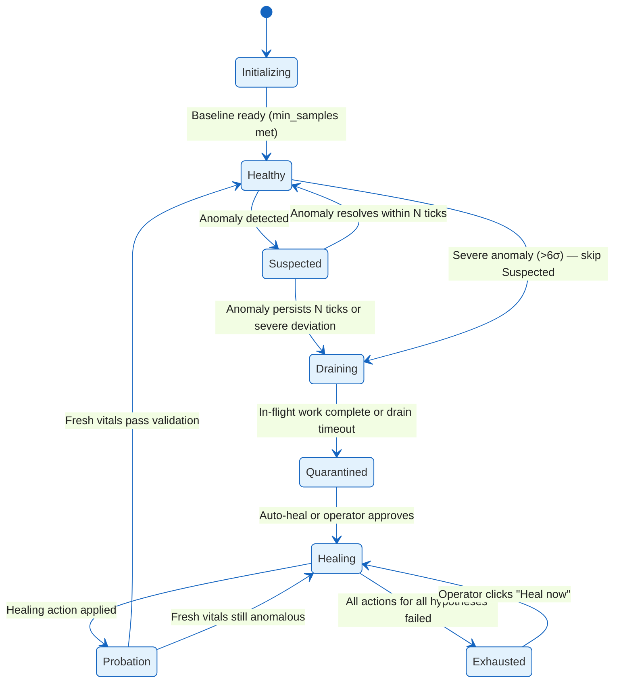
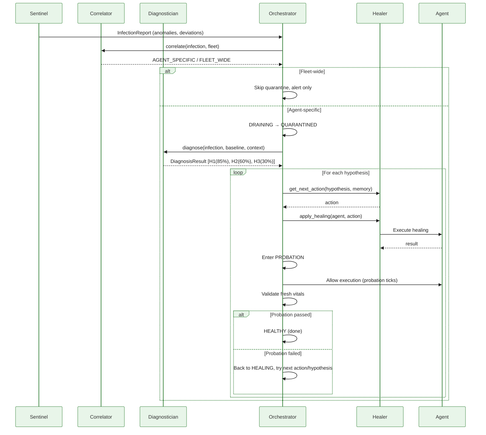

# Agent Lifecycle, Enforcement, and Healing

This document describes the agent lifecycle state machine, enforcement strategies,
healing executors, and the multi-hypothesis diagnosis flow.  It is the authoritative
reference for understanding how the immune system takes **real actions** on
production agents.

---

## 1. State Machine

Every agent goes through 8 lifecycle phases:



### State Summary

| State | Agent Runs? | Monitoring? | Description |
|---|:---:|:---:|---|
| **INITIALIZING** | Yes | No | Baseline learning.  No anomaly detection. |
| **HEALTHY** | Yes | Yes | Normal operation. |
| **SUSPECTED** | Yes | Yes (heightened) | Anomaly detected but not yet confirmed.  Requires N consecutive anomaly ticks before escalation. |
| **DRAINING** | In-flight only | Yes | Quarantine ordered.  No new requests accepted.  In-flight work allowed to finish (with timeout). |
| **QUARANTINED** | No | No | Fully isolated.  All execution blocked via enforcement. |
| **HEALING** | No | No | Active healing in progress.  Execution blocked. |
| **PROBATION** | Yes | Yes | Post-healing observation.  Agent runs normally while fresh vitals are collected and validated. |
| **EXHAUSTED** | No | No | All healing options failed.  Awaiting manual intervention. |

### Key Design Decisions

- **SUSPECTED prevents false positives**: A single anomalous tick doesn't quarantine.  The anomaly must persist for `suspect_ticks` (default: 3) consecutive monitoring cycles.
- **DRAINING handles in-flight work**: When quarantine is triggered, the agent may be mid-request.  DRAINING blocks *new* requests but lets the current one finish (with a configurable timeout, default 30s).
- **PROBATION fixes validation**: The old system validated healing by checking *pre-quarantine* telemetry (the agent wasn't running during healing, so it was checking stale data).  PROBATION actually lets the agent run, collects fresh vitals, and validates against the baseline.

---

## 2. Enforcement Strategies

Enforcement is **pluggable**.  The immune system supports four strategies:

### 2.1 Gateway Enforcement (recommended)

Works for **any** agent that routes LLM traffic through the immune system's gateway.

| Action | Mechanism |
|---|---|
| **Block** | Inject a `PolicyRule` with `action=BLOCK` for the agent ID |
| **Unblock** | Remove the blocking policy rule |
| **Drain** | Block new requests; in-flight requests complete naturally |

**Advantages**: No OS-level permissions needed.  Works across network boundaries.  Agent process is unaware of quarantine.

### 2.2 Process Enforcement

For agents running as **OS processes on the same host** as the immune system.

| Action | Mechanism |
|---|---|
| **Block** | `SIGSTOP` — pauses the process at OS level |
| **Unblock** | `SIGCONT` — resumes the process |
| **Drain** | `SIGUSR1` (agent-defined graceful shutdown) + timeout → `SIGSTOP` |

**Requirements**: Immune system must run as the same user or root.  Agent PID must be registered.

### 2.3 Container Enforcement

For agents running as **Docker containers or Kubernetes pods**.

| Action | Mechanism |
|---|---|
| **Block** | `docker pause` / `kubectl scale --replicas=0` |
| **Unblock** | `docker unpause` / `kubectl scale --replicas=1` |
| **Drain** | Wait for timeout → block |

**Requirements**: Docker socket access or Kubernetes RBAC.

### 2.4 Composite Enforcement

Chains multiple strategies in priority order.  Tries gateway first, falls back to process, then container.

### 2.5 NoOp Enforcement

In-memory only.  Used for simulations and testing.

### Comparison

| Criterion | Gateway | Process | Container | Composite |
|---|---|---|---|---|
| **Scope** | Any gateway-routed agent | Same host only | Docker/K8s managed | Multi-environment |
| **Permissions** | None (gateway-internal) | Same user / root | Docker socket / K8s RBAC | Varies |
| **In-flight handling** | Natural (HTTP) | SIGSTOP (hard) | Pause (Docker) / scale (K8s) | Best-effort |
| **Latency** | <1ms | <1ms | ~1s | First success |
| **Recommended for** | SaaS / multi-tenant | Dev / single-host | Cloud-native | Enterprise |

---

## 3. Healing Actions and Executors

### 3.1 Action Mapping by Executor

| Action | Simulated | Gateway | Process | Container |
|---|---|---|---|---|
| **RESET_MEMORY** | `agent.state.memory.clear()` | Inject `X-Clear-Context` header | `POST /control/reset-memory` | Fallback to process |
| **ROLLBACK_PROMPT** | `prompt_version -= 1` | Alert operator (no generic API) | `POST /control/rollback-prompt` | Fallback to process |
| **REDUCE_AUTONOMY** | `temp *= 0.5; tools -= 2` | Inject rate-limit policy (2 rpm, 500 tok) | `POST /control/reduce-autonomy` | Patch ConfigMap + restart |
| **REVOKE_TOOLS** | `tools_revoked = True` | Block function-calling models | `POST /control/revoke-tools` | Fallback to process |
| **RESET_AGENT** | Full state reset | Full block + operator alert | `SIGTERM` + wait + verify | `kubectl rollout restart` |

### 3.2 Healing Policy Ladder

For each diagnosis type, actions are tried in order.  The order is **reranked** by global success patterns learned across the fleet:

| Diagnosis | Default Policy Order |
|---|---|
| Prompt Drift | RESET_MEMORY → ROLLBACK_PROMPT → REDUCE_AUTONOMY → RESET_AGENT |
| Prompt Injection | REVOKE_TOOLS → RESET_MEMORY → ROLLBACK_PROMPT → RESET_AGENT |
| Infinite Loop | REVOKE_TOOLS → REDUCE_AUTONOMY → RESET_MEMORY → RESET_AGENT |
| Tool Instability | REDUCE_AUTONOMY → ROLLBACK_PROMPT → RESET_AGENT |
| Memory Corruption | RESET_MEMORY → RESET_AGENT |
| Cost Overrun | REDUCE_AUTONOMY → ROLLBACK_PROMPT → RESET_MEMORY → RESET_AGENT |
| External Cause | REDUCE_AUTONOMY → RESET_AGENT |
| Unknown | RESET_MEMORY → REDUCE_AUTONOMY → RESET_AGENT |

---

## 4. Multi-Hypothesis Diagnosis

The diagnostician returns **ranked hypotheses** instead of a single diagnosis.  If healing for the primary hypothesis fails, the orchestrator falls back to the next hypothesis:



---

## 5. Adaptive Learning

### 5.1 Negative Learning (Avoid Failures)

When an action fails for agent+diagnosis, it is recorded.  The system **never** retries that action for the same agent+diagnosis combination.

### 5.2 Positive Learning (Prefer Successes)

When an action succeeds for any agent+diagnosis, it is recorded in `global_success_patterns`.  The policy ladder is **reordered** so globally-successful actions are tried first:

```
Default policy: RESET_MEMORY → ROLLBACK_PROMPT → REDUCE_AUTONOMY → RESET_AGENT
Global success: ROLLBACK_PROMPT(5 wins), REDUCE_AUTONOMY(2 wins), RESET_MEMORY(1 win)
Reordered:      ROLLBACK_PROMPT → REDUCE_AUTONOMY → RESET_MEMORY → RESET_AGENT
```

### 5.3 Cross-Agent Generalization

When agent-X is diagnosed with PROMPT_DRIFT, the system checks what worked for ALL agents with PROMPT_DRIFT across the fleet.  Actions that have high global success rates are prioritized.

### 5.4 Operator Feedback Loop

Operators can submit feedback on past diagnoses via `POST /api/feedback`:

```json
{
    "agent_id": "agent-1",
    "actual_cause": "provider_outage",
    "notes": "OpenAI had a 5min outage"
}
```

Valid `actual_cause` values:
- `false_positive` — no actual issue (adjusts confidence down)
- `wrong_diagnosis` — issue was real but diagnosis was incorrect
- `provider_outage` — external provider problem
- `correct` — confirms the diagnosis

This feedback adjusts the diagnostician's confidence for similar patterns in the future.

### 5.5 Baseline Adaptation After Healing

After successful healing, the agent's "normal" may have changed (e.g. reduced autonomy lowers token usage).  Two modes:

- **Accelerate**: Temporarily increase EWMA alpha (faster adaptation) for 50 ticks so the baseline converges to the new normal quickly.
- **Hard reset**: Clear baseline entirely and re-learn from scratch.

The default is `accelerate_learning()`, called automatically after probation passes.

---

## 6. Use Cases

### UC-1: False-Positive Anomaly

1. Sentinel detects anomaly on agent-X → **HEALTHY** → **SUSPECTED**
2. Next tick: anomaly not present → **SUSPECTED** → **HEALTHY**
3. No quarantine, no healing.  The 3-tick suspect window absorbed the noise.

### UC-2: Standard Anomaly → Auto-Heal → Recovery

1. Sentinel detects anomaly for 3 consecutive ticks → **SUSPECTED** → **DRAINING**
2. In-flight request completes → **DRAINING** → **QUARANTINED**
3. Deviation < 5σ → auto-heal triggered → **QUARANTINED** → **HEALING**
4. Diagnostician: PROMPT_DRIFT (85%), COST_OVERRUN (60%)
5. Healer tries RESET_MEMORY → **HEALING** → **PROBATION**
6. 10 probation ticks collected, sentinel shows no anomaly → **PROBATION** → **HEALTHY**

### UC-3: Severe Anomaly → Approval Required

1. Sentinel detects 7σ deviation → skip SUSPECTED → **DRAINING** → **QUARANTINED**
2. Deviation ≥ 5σ → approval requested in dashboard
3. Operator reviews and clicks "Approve" → **QUARANTINED** → **HEALING**
4. Healer applies action → **PROBATION** → **HEALTHY**

### UC-4: Operator Rejects → Manual Heal Later

1. Approval requested, operator clicks "Reject" → **QUARANTINED** → **EXHAUSTED**
2. Agent stays in EXHAUSTED until operator clicks "Heal now"
3. "Heal now" clicked → **EXHAUSTED** → **HEALING** → standard flow

### UC-5: Primary Hypothesis Fails → Secondary Hypothesis

1. Diagnostician returns [PROMPT_INJECTION(90%), PROMPT_DRIFT(60%)]
2. All actions for PROMPT_INJECTION fail (REVOKE_TOOLS, RESET_MEMORY, ROLLBACK_PROMPT, RESET_AGENT)
3. Orchestrator tries PROMPT_DRIFT hypothesis
4. RESET_MEMORY succeeds → probation passes → **HEALTHY**

### UC-6: Fleet-Wide Anomaly → No Quarantine

1. Sentinel detects anomaly on agent-X
2. Correlator checks fleet: 40% of agents show the same latency spike
3. Verdict: FLEET_WIDE → skip quarantine, log alert
4. Agent-X returns to HEALTHY (or stays SUSPECTED until anomaly resolves)

### UC-7: In-Flight Work During Drain

1. Agent is mid-request when quarantine is ordered
2. Agent enters DRAINING state
3. Gateway stops forwarding new requests (503)
4. In-flight request completes naturally
5. After completion (or drain timeout of 30s) → **QUARANTINED**

### UC-8: Gateway Enforcement Blocks LLM Access

1. Agent quarantined → GatewayEnforcement injects `PolicyRule(action=BLOCK)`
2. Agent's next LLM request gets HTTP 503 with `"Agent is quarantined by immune system"`
3. After healing → policy rule removed, agent resumes LLM access

### UC-9: Process Enforcement Pauses Agent

1. Agent PID registered with ProcessEnforcement
2. Agent quarantined → `os.kill(pid, SIGSTOP)` — process frozen at OS level
3. After healing → `os.kill(pid, SIGCONT)` — process resumes

### UC-10: Container Enforcement Scales Down Pod

1. Agent K8s deployment registered with ContainerEnforcement
2. Agent quarantined → `kubectl scale --replicas=0` — pod terminated
3. After healing → `kubectl scale --replicas=1` — new pod starts
