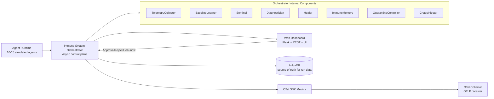
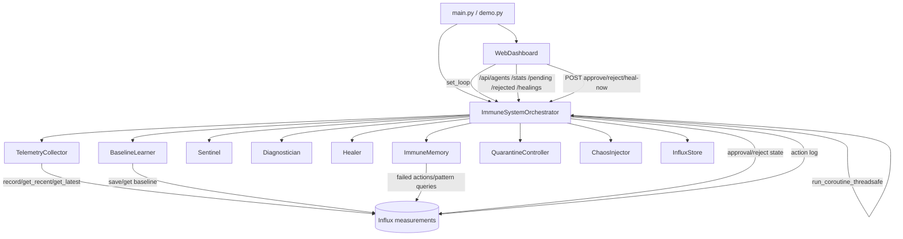
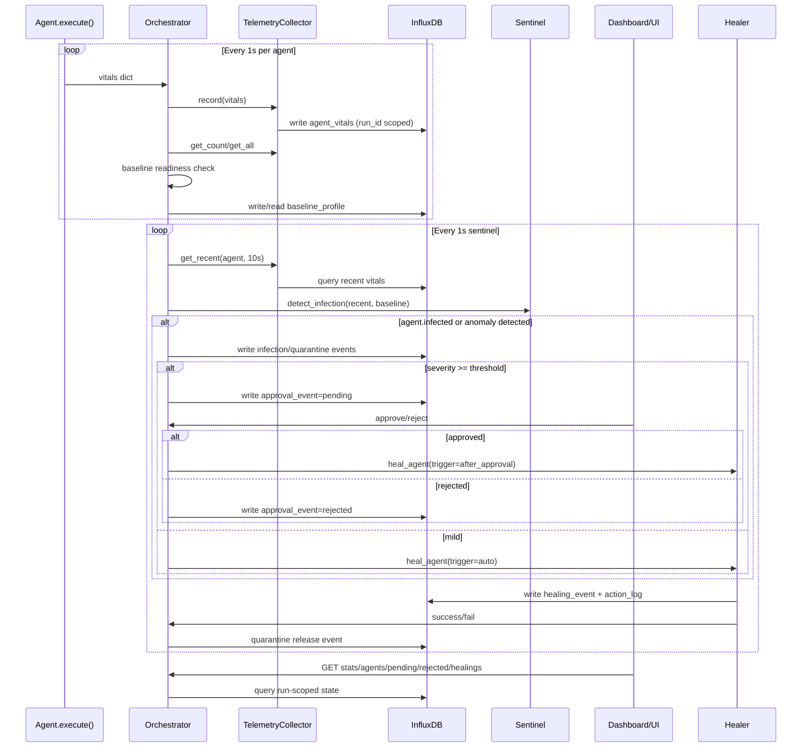

# ARCHITECTURE

## Overview
The AI Agent Immune System is an async control plane that monitors agent vitals, learns baselines, detects infections, quarantines unhealthy agents, and heals them with policy-driven actions (plus user approvals for severe cases).

Persistence is InfluxDB-backed for telemetry and workflow state (run-scoped via `run_id`).

---

## HLD (High-Level Design)

---

## LLD (Low-Level Design)

---

## Data Flow Diagram

---

## Component Mapping

- `main.py`
  - App entrypoint, OTel configuration, Influx store wiring, run duration control.
- `demo.py`
  - Demo entrypoint, dashboard startup with event loop reference, configurable duration.
- `orchestrator.py`
  - Core event loops: agent execution, sentinel detection, healing, approval/rejection workflow.
- `agents.py`
  - Simulated agents and infection modes; emits vitals each execution.
- `telemetry.py`
  - Telemetry abstraction and OTel metric instruments.
- `baseline.py`
  - Baseline profile learning and retrieval.
- `detection.py`
  - Statistical anomaly detection and severity scoring.
- `diagnosis.py`
  - Rule-based diagnosis from anomaly patterns.
- `healing.py`
  - Healing policies and action execution/validation.
- `memory.py`
  - Immune memory (failed actions/pattern summaries), backed by DB queries.
- `web_dashboard.py`
  - REST API + UI rendering; user actions for approval/rejection/heal-now.
- `influx_store.py`
  - InfluxDB persistence/query layer for telemetry, baselines, approvals, healing events, action logs.
- `observability/docker-compose.yml`
  - Local InfluxDB and OTel Collector stack.
- `observability/otel-collector-config.yaml`
  - OTLP receiver + debug exporter pipeline.

---

## Runtime Notes

- Tick interval: 1 second (agent loop and sentinel loop).
- Baseline warmup: ~15 samples per agent.
- Severe infections require explicit approval.
- Rejected healings remain quarantined until user clicks Heal now.
- Run isolation: all Influx reads/writes are filtered by `run_id` to avoid historical contamination.

---

## Current Tradeoffs (POC)

- InfluxDB-only workflow state is event-sourced and eventually consistent enough for demo scale.
- For production-grade strict state transitions, a transactional workflow store can be added later while keeping Influx for telemetry.
