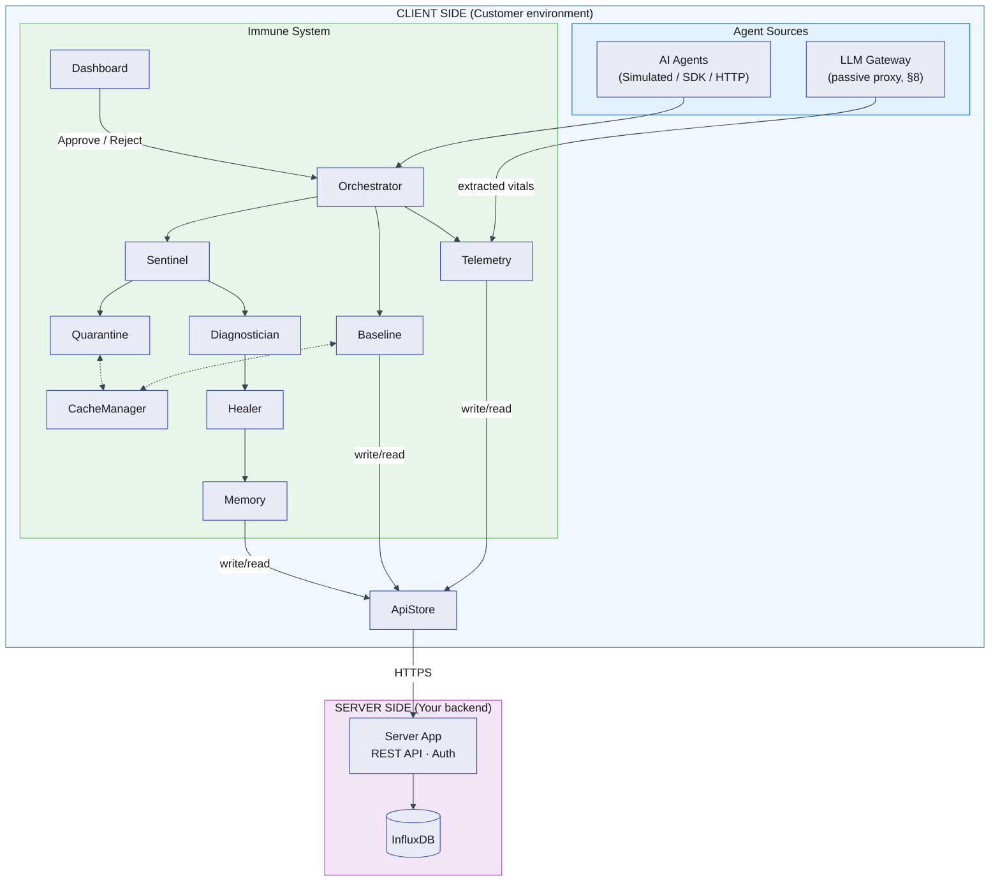
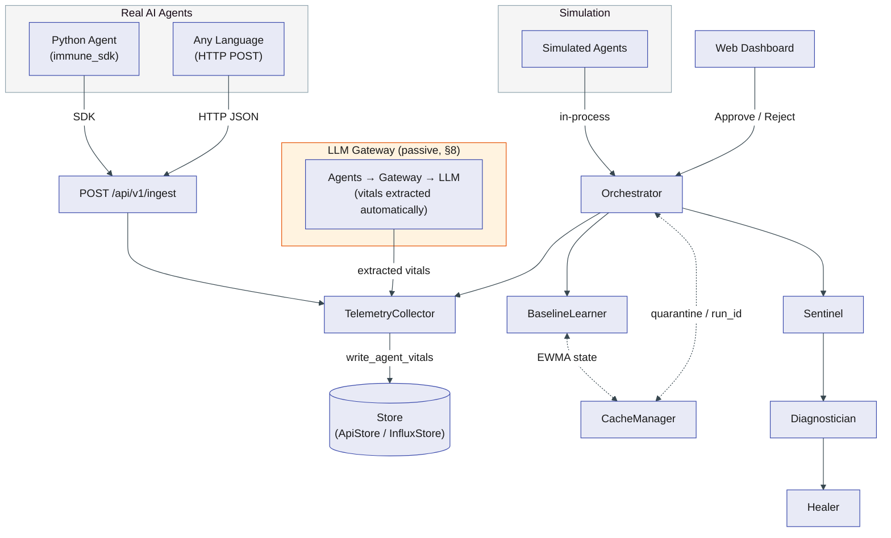
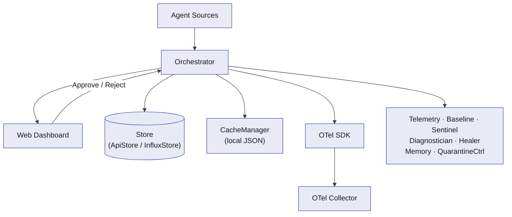
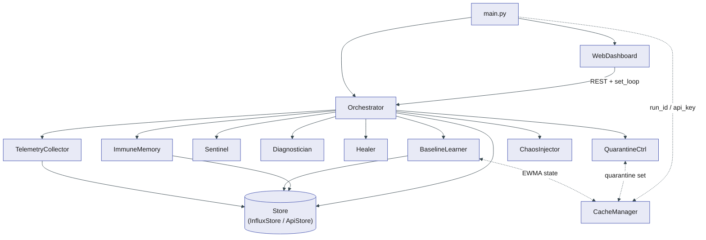
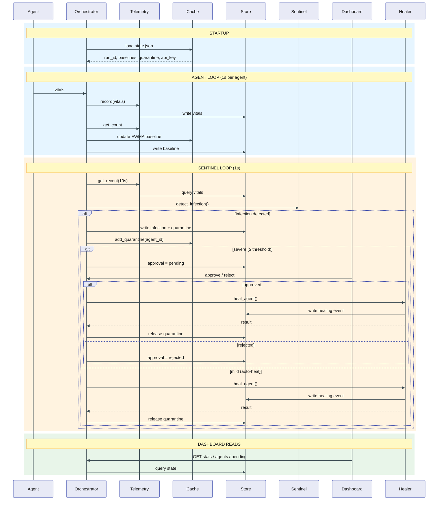
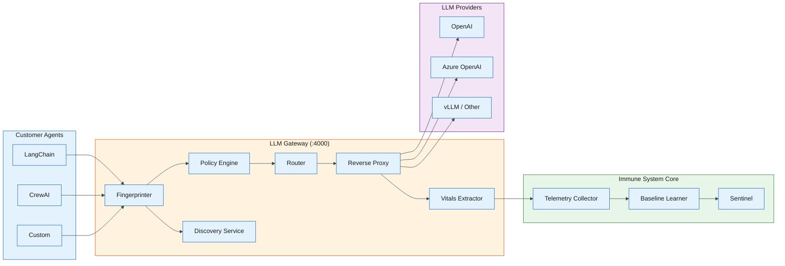
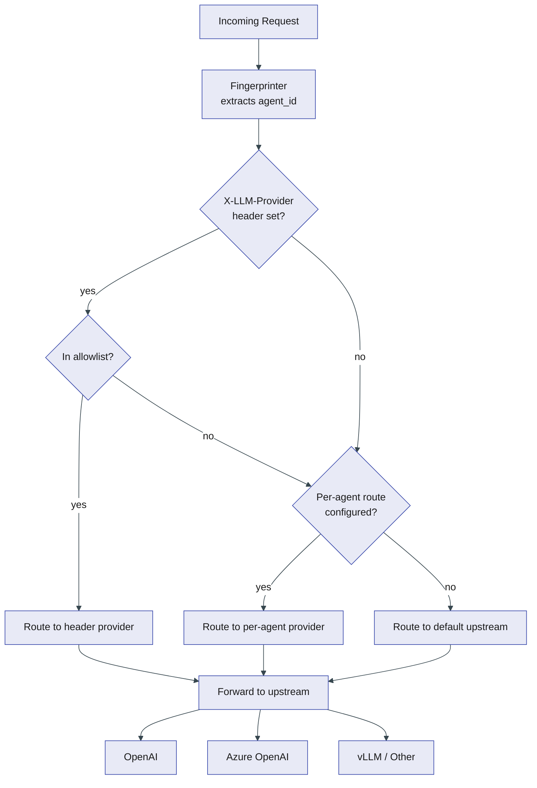
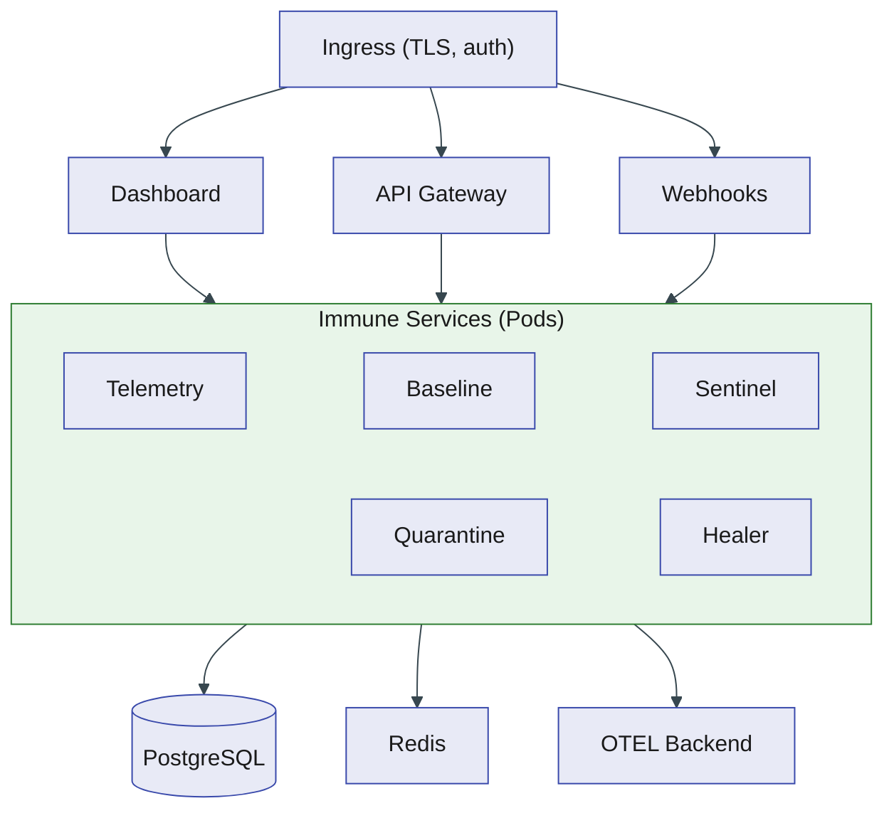

# AI Agent Immune System — Documentation (Single Reference)

This document is the **single reference** for the AI Agent Immune System: architecture, deployment, server API, healing and deviation, internal design (HLD — High-Level Design / LLD — Low-Level Design), and operations. Keep this doc as the source of truth; update it when anything changes.

> **Viewing diagrams:** This doc uses [Mermaid](https://mermaid.js.org/) diagrams. They render natively on **GitHub**. In **VS Code / Cursor**, install the [Markdown Preview Mermaid Support](https://marketplace.visualstudio.com/items?itemName=bierner.markdown-mermaid) extension (`bierner.markdown-mermaid`), then preview with `Cmd+Shift+V`.

---

## 1. Executive Summary

| Layer | Role | Components |
|-------|------|-------------|
| **Client** | Apps, AI agents, and **immune system** | AI agents, full immune system (orchestrator, sentinel, healer, dashboard), **CacheManager** (local restart resilience), **ApiStore** (calls server REST API; no direct DB) |
| **Server** | API + persistence | **Server app** (REST API only) + **InfluxDB**; no immune-system logic |
| **Optional** | Visibility | AppDynamics Controller for agent OpenTelemetry (OTEL) metrics and/or immune-system events |

- **Self-healing:** When **max_deviation** (σ = standard deviations from normal baseline) is **below** `DEVIATION_REQUIRING_APPROVAL` (default 5.0σ), the system **auto-heals**. Above that threshold → **human-in-the-loop** (pending approval in the dashboard). The UI displays deviation in σ (e.g. 5.2σ).
- **Deviation** is calculated in **one place:** **Sentinel** (`immune_system/detection.py`), in `detect_infection(recent_vitals, baseline)`. Baselines are maintained via **EWMA** (Exponential Weighted Moving Average) and cached locally for restart resilience.
- **Restart resilience:** **CacheManager** (`~/.immune_cache/state.json`) persists EWMA baselines, quarantine state, `run_id`, and API key across restarts — no cold-start warmup delay or state loss.

**Alternative deployment:** Server-side — immune system as separate services (telemetry, baseline, sentinel, healer) on Kubernetes/OpenShift with a central DB. This doc focuses on the **recommended** client-deployed model.

---

## 2. Architecture (Client-Deployed)

### 2.1 Topology overview



- **Client:** AI agents + full immune system; store is **ApiStore** (HTTP to server only). No InfluxDB client on the client.
- **Server:** One application exposing the REST API (§6); it reads/writes InfluxDB (same schema as `InfluxStore`). No immune-system business logic (no sentinel, healer, or dashboard).
- **Backend:** InfluxDB only; all access via server API.

### 2.2 Client-side components (what runs at the customer)

| Component | Responsibility |
|-----------|-----------------|
| **AI agents** | Execute tasks; produce **vitals** — health metrics per task, analogous to a patient's vital signs (latency_ms, input_tokens, output_tokens, token_count, tool_calls, retries, success, cost, model, error_type, prompt_hash). Each agent has a stable `agent_id` (and optional agent_type, model, mcp_servers — MCP = Model Context Protocol, a standard for tool/resource access). |
| **Orchestrator** | Runs agent loops, sentinel loop, baseline learning; coordinates all components; uses **store** for persistence. |
| **TelemetryCollector** | Records vitals via `store.write_agent_vitals()`; reads recent vitals via `store.get_recent_agent_vitals()`, etc. |
| **BaselineLearner** | EWMA adaptive baselines per metric per agent. Continuously updates on each vitals sample. State cached locally (CacheManager) and periodically persisted to store. |
| **Sentinel** | **Deviation calculated here.** Compares recent vitals to EWMA baseline in `detect_infection(recent, baseline)`; emits InfectionReport (max_deviation, anomalies). Uses a stddev floor (5% of mean) when stddev is 0 — this prevents metrics that were constant during learning from being invisible to detection. |
| **Diagnostician** | Multi-hypothesis root-cause analysis: maps anomaly patterns to ranked diagnosis types (prompt_drift, prompt_injection, infinite_loop, tool_instability, cost_overrun, external_cause, unknown) with confidence scores.  Supports operator feedback to adjust accuracy over time. |
| **Healer** | Applies policy ladder + immune memory; uses pluggable executors (simulated, gateway, process, container); success-weighted action selection reorders the policy based on global success patterns; probation-based post-healing validation with fresh vitals. Actions: reset_memory, rollback_prompt, reduce_autonomy, revoke_tools, reset_agent. |
| **QuarantineController** | Tracks quarantined agent IDs with pluggable enforcement strategies; supports async quarantine/release/drain; persisted to CacheManager for restart resilience; approval workflow state (pending/rejected) read/written via store. |
| **ImmuneMemory** | Records per-agent per-diagnosis healing outcomes; tracks global success/failure patterns for cross-agent generalization; stores operator feedback; pattern summary via store. |
| **Web Dashboard** | Serves UI; reads state from orchestrator (which reads from store); POST approve/reject/heal-now; POST /api/feedback for operator diagnosis corrections. |
| **CacheManager** | Local JSON file cache (`~/.immune_cache/state.json`). Persists run_id, EWMA baselines, quarantine set, and API key across restarts. Atomic writes (temp + rename). Periodic flush (30s). File permissions restricted to owner (0600). |
| **Store** | **ApiStore** when `SERVER_API_BASE_URL` is set: same interface as `InfluxStore`, but every call is HTTP to the server REST API. No direct InfluxDB. |

Entry point: `main.py` with `SERVER_API_BASE_URL` (and optional `SERVER_API_KEY`, `SERVER_RUN_ID`) → orchestrator gets ApiStore; otherwise `INFLUXDB_*` → InfluxStore, or in-memory.

### 2.3 Server-side (API layer + InfluxDB)

- **Server app:** Exposes REST endpoints (§6); authenticates requests (e.g. API key, `X-Run-Id`); for each request runs the corresponding InfluxDB read/write (same logic as `InfluxStore`). No detection, healing, or baseline logic.
- **InfluxDB:** Same schema as current `InfluxStore`: measurements and fields for agent_vitals, baseline_profile, infection_event, quarantine_event, approval_event, healing_event, action_log; tag `run_id` for multi-tenant/run isolation.

### 2.4 Data flow (client-deployed)

0. **Startup:** `main.py` loads CacheManager → restores `run_id`, EWMA baselines, quarantine set, and API key. If cache is missing or corrupt, starts fresh (InfluxDB is the fallback source of truth).
1. **Vitals:** Each agent run → TelemetryCollector.record(vitals) → ApiStore → `POST /api/v1/vitals` → server writes to InfluxDB.
2. **Baseline:** Orchestrator (agent loop) passes each vitals sample to BaselineLearner.update() → EWMA state updated in cache; periodically persisted to store via store.write_baseline_profile().
3. **Detection:** Sentinel loop: for each agent, get recent vitals (store GET → server → InfluxDB) and baseline (from EWMA cache); call **Sentinel.detect_infection(recent, baseline)** → deviation computed here; if infection, quarantine (persisted to cache) and either add to pending (max_deviation ≥ threshold) or schedule heal_agent (max_deviation < threshold).
4. **Approval / healing:** Dashboard reads pending/rejected and healing log via orchestrator (store GETs). User Approve/Reject/Heal-now → orchestrator updates store (POST) → server → InfluxDB. Healer runs on client and writes healing events via store.

### 2.5 Component-to-file mapping (codebase)

| Component | File | Notes |
|-----------|------|--------|
| Entry point | `main.py` | Store selection (ApiStore vs InfluxStore vs in-memory), orchestrator + dashboard. |
| Orchestrator | `immune_system/orchestrator.py` | Agent loop, sentinel loop, approval/heal-now, store usage. |
| Agents | `immune_system/agents.py` | BaseAgent, AgentState, vitals emission, infection simulation. |
| Telemetry | `immune_system/telemetry.py` | TelemetryCollector; record, get_recent, get_all, get_latest. |
| Baseline | `immune_system/baseline.py` | EWMA BaselineLearner, BaselineProfile; update(), get_baseline; cached + store-persisted. |
| Sentinel | `immune_system/detection.py` | **Deviation** (max_deviation) in detect_infection(recent_vitals, baseline). stddev floor for constant metrics. |
| Cache | `immune_system/cache.py` | CacheManager; local state persistence (run_id, baselines, quarantine, API key). |
| Diagnosis | `immune_system/diagnosis.py` | Diagnostician; anomaly pattern → diagnosis type. |
| Healing | `immune_system/healing.py` | Healer, HEALING_POLICIES, healing actions. |
| Memory | `immune_system/memory.py` | ImmuneMemory; failed actions, pattern summary. |
| Quarantine | `immune_system/quarantine.py` | QuarantineController; quarantine/release set. |
| Dashboard | `immune_system/web_dashboard.py` | Flask REST + UI; approve/reject/heal-now. |
| Store (direct DB) | `immune_system/influx_store.py` | InfluxStore when using InfluxDB directly. |
| Store (API) | `immune_system/api_store.py` | ApiStore when using server REST API. |
| Lifecycle | `immune_system/lifecycle.py` | 8-state agent lifecycle state machine (INITIALIZING through EXHAUSTED). |
| Enforcement | `immune_system/enforcement.py` | Pluggable enforcement: GatewayEnforcement, ProcessEnforcement, ContainerEnforcement, CompositeEnforcement. |
| Executor | `immune_system/executor.py` | Pluggable healing executors: SimulatedExecutor, GatewayExecutor, ProcessExecutor, ContainerExecutor. |
| Correlator | `immune_system/correlator.py` | Fleet-wide anomaly correlation to distinguish agent-specific vs. systemic issues. |
| Chaos | `immune_system/chaos.py` | ChaosInjector; optional demo infection injection. |
| Python SDK | `immune_sdk.py` | Lightweight reporter for external Python agents (wraps HTTP ingest). |
| Start scripts | `start-local.sh`, `start-server.sh`, `start-gateway.sh`, `stop.sh` | Start infrastructure and client in local, server, or gateway mode; stop tears down containers. |
| Server API | `server/app.py` | REST bridge between ApiStore clients and InfluxDB (DOCS §6). |
| Dockerfile | `Dockerfile` | Container image for the server API. |
| Docker Compose | `docker-compose.yml` | Full stack: InfluxDB + OTEL + Server API. |

### 2.6 Agent–immune system communication (client-side)

How agents and the immune system communicate. The system supports **two modes simultaneously**: simulated agents running in-process (for demos) and real external agents reporting via HTTP or the Python SDK.



**Mode 1 — Simulated agents (in-process, for demos):**
- The **orchestrator** owns the asyncio loop and drives both agents and the immune system.
- Each tick, for each agent: `vitals = await agent.execute()` then `self.telemetry.record(vitals)`.
- Communication is **synchronous in-process**: orchestrator pulls vitals from agents and pushes them into `TelemetryCollector`, which either keeps them in memory or writes to the store (InfluxDB or server API).
- The immune system never calls into the agent except for healing (e.g. `agent.state.reset_memory()`). Agents do not call the immune system; the orchestrator is the only bridge.

**Mode 2 — Real external agents (HTTP ingest + Python SDK):**

Real agents report vitals via the implemented HTTP ingest endpoint or the Python SDK. Both paths write into the same `TelemetryCollector` and flow through the same baseline/detection/healing pipeline.

- **HTTP API (`POST /api/v1/ingest`):** Any agent in any language POSTs a JSON payload with vitals fields (`agent_id`, `input_tokens`, `output_tokens`, `latency_ms`, `tool_calls`, `cost`, `model`, `error_type`, `prompt_hash`, etc.). Unknown agents are auto-registered. Endpoint is on the dashboard Flask server (port 8090).
- **Python SDK (`immune_sdk.py`):** Python agents import `ImmuneReporter` and call `reporter.report(...)` after each LLM call. The SDK wraps `POST /api/v1/ingest` and handles auto-registration.
- **Agent registration (`POST /api/v1/agents/register`):** Optional explicit registration with `agent_id`, `agent_type`, and `model`. The ingest endpoint auto-registers on first vitals report if the agent is unknown.

**Vitals fields (production):**

| Field | Source | Description |
|-------|--------|-------------|
| `input_tokens` | LLM response `usage.prompt_tokens` | Prompt / input tokens |
| `output_tokens` | LLM response `usage.completion_tokens` | Completion / output tokens |
| `token_count` | `input_tokens + output_tokens` | Total tokens (backward compat) |
| `latency_ms` | Wall-clock measurement | End-to-end agent turn latency |
| `tool_calls` | Agent framework | Number of tool/function calls |
| `retries` | Agent retry logic | Number of retry attempts |
| `cost` | Calculated from tokens × model price | Estimated cost in USD |
| `model` | Agent config | LLM model used (e.g. `gpt-4o`) |
| `error_type` | Agent error handling | Error category (`rate_limit`, `timeout`, `content_filter`, or empty) |
| `prompt_hash` | Hash of system prompt | Detects prompt drift / injection |
| `success` | Agent outcome | Whether the task completed |

**Mode 3 — LLM Gateway (passive observation, zero code changes):**

The gateway (`gateway/app.py`) acts as a reverse proxy between customer agents and their LLM providers. Agents point `OPENAI_BASE_URL` at the gateway — one env-var change. The gateway passively extracts vitals from every LLM request/response pair and feeds them into the same `TelemetryCollector`. See §8 for full architecture.

**Other integration patterns (not yet implemented):**
- **Pull by immune system:** Immune system reads vitals from a **shared store** (e.g. InfluxDB or server API) that agents write to independently.
- **OTEL / tracing:** Agents emit OTEL metrics/spans; the immune system reads from the same backend the collector writes to.

---

## 3. Internal Design (HLD / LLD / Data Flow)

The system runs as an asynchronous control plane (it monitors and manages agents without blocking their execution). Persistence can be **InfluxDB-backed** (run-scoped via `run_id`) or **server API–backed** (ApiStore when `SERVER_API_BASE_URL` is set).

### 3.1 HLD (High-Level Design)



### 3.2 LLD (Low-Level Design)



*Note: Store may be InfluxStore or ApiStore; when ApiStore, all DB operations go via HTTP to the server.*

### 3.3 Data flow (sequence)



### 3.4 Component mapping (file-level)

- `main.py` — Entry point; import from `immune_system` package.
- `immune_system/` — Python package containing all core modules.
- `immune_system/orchestrator.py` — Core event loops: agent execution, sentinel detection, healing, approval/rejection workflow.
- `immune_system/agents.py` — Simulated agents and infection modes; emits vitals each execution.
- `immune_system/telemetry.py` — Telemetry abstraction and OTel metric instruments.
- `immune_system/baseline.py` — Baseline profile learning and retrieval.
- `immune_system/detection.py` — Statistical anomaly detection and deviation scoring (deviation calculated here).
- `immune_system/diagnosis.py` — Multi-hypothesis diagnosis from anomaly patterns; ranked hypotheses with confidence scores; operator feedback adjustment.
- `immune_system/healing.py` — Healing policies, pluggable executor-based action execution, success-weighted selection, probation-based validation.
- `immune_system/memory.py` — Immune memory (failed actions, global success/failure patterns, operator feedback), backed by store queries.
- `immune_system/web_dashboard.py` — REST API + UI rendering; user actions for approval/rejection/heal-now.
- `immune_system/influx_store.py` — InfluxDB persistence/query layer (used when `INFLUXDB_*` is set).
- `immune_system/api_store.py` — Server API–backed store (used when `SERVER_API_BASE_URL` is set). See §6 for API contract.
- `immune_system/logging_config.py` — Logging setup (JSON or colored console).
- `immune_system/quarantine.py` — Quarantine controller with pluggable enforcement.
- `immune_system/lifecycle.py` — 8-state agent lifecycle state machine.
- `immune_system/enforcement.py` — Pluggable enforcement strategies (gateway, process, container, composite).
- `immune_system/executor.py` — Pluggable healing executors (simulated, gateway, process, container).
- `immune_system/correlator.py` — Fleet-wide anomaly correlation.
- `immune_system/chaos.py` — ChaosInjector; demo infection injection.
- `immune_sdk.py` — Lightweight Python SDK for external agents (wraps `POST /api/v1/ingest`).
- `server/app.py` — Server API: REST bridge between ApiStore and InfluxDB (implements §6).
- `gateway/app.py` — LLM Gateway: Flask app serving the reverse proxy and management API (§8).
- `gateway/proxy.py` — Core reverse proxy: forwards to upstream LLM, extracts vitals.
- `gateway/vitals_extractor.py` — Parses OpenAI request/response pairs into vitals dicts.
- `gateway/fingerprint.py` — Derives agent IDs from API keys, IPs, headers.
- `gateway/discovery.py` — Auto-discovery registry for agents.
- `gateway/policy.py` — Policy engine: rate limits, model access, token budgets.
- `gateway/routing.py` — Multi-provider routing: ProviderRegistry (allowlisted upstreams) and RoutingTable (per-agent upstream assignment with three-tier resolution: header → per-agent → default).
- `gateway/mcp_proxy.py` — Optional MCP tool-call observation proxy.
- `gateway/otel_processor.py` — Optional OTEL SpanProcessor for `gen_ai.*` spans.
- `start-local.sh`, `start-server.sh`, `start-gateway.sh`, `stop.sh` — Start/stop scripts for local, server, and gateway modes.
- `docker-compose.yml` — Full stack: InfluxDB + OTEL Collector + Server API + LLM Gateway.
- `Dockerfile.gateway` — Docker image for the LLM Gateway.
- `observability/otel-collector-config.yaml` — OTEL Collector configuration: OTLP receiver + debug exporter pipeline (mounted by docker-compose).

---

## 4. Healing and Deviation (Single Place to Update)

### 4.1 Where deviation is calculated

**Only in:** `immune_system/detection.py` → **`Sentinel.detect_infection(recent_vitals, baseline)`**

- **Inputs:** `recent_vitals` (e.g. last 10s from store/InfluxDB), `baseline` (EWMA mean/stddev per metric, cached locally and backed by store).
- **Logic:** For each metric (latency, tokens, cost, tools, retry rate, error rate), computes: how far is the recent average from the learned normal? Formally: `deviation = |recent_avg − baseline_mean| / stddev`. If this deviation exceeds `threshold_stddev` (default 2.5σ), it's flagged as an anomaly. Also checks whether the system prompt hash changed vs baseline (prompt drift/injection detection).
- **Stddev floor:** When baseline stddev is 0 (constant metric during learning), a floor of 5% of the mean is used so that any change is detectable.
- **Retry/error rates:** Now use consistent stddev-based deviation (no more `× 10` multiplier).
- **Anomaly types:** `token_spike`, `latency_spike`, `tool_explosion`, `high_retry_rate`, `input_token_spike`, `output_token_spike`, `cost_spike`, `prompt_change`, `error_rate_spike`.
- **Output:** `InfectionReport` (max_deviation in σ, anomalies, deviations).

Orchestrator feeds each vitals sample into the EWMA baseline learner and calls `sentinel.detect_infection(recent, baseline)` for each agent on the sentinel loop.

### 4.2 Self-heal vs human-in-the-loop

| Threshold | Behavior |
|----------|----------|
| **< DEVIATION_REQUIRING_APPROVAL** (default **5.0σ**) | **Self-healing:** Orchestrator schedules `heal_agent()`; healer runs policy ladder + immune memory. |
| **≥ 5.0σ** | **HITL (Human-In-The-Loop):** Quarantine + add to pending approvals; healing only after Approve (or Heal now for rejected). |

- **Config:** `immune_system/orchestrator.py`: `DEVIATION_REQUIRING_APPROVAL = 5.0`. Detection sensitivity: `Sentinel(threshold_stddev=2.5)` in `immune_system/detection.py`.

### 4.3 Agent state and healing actions

- **reset_memory** → `agent.state.reset_memory()`  
- **rollback_prompt** → `agent.state.rollback_prompt()`  
- **reduce_autonomy** → `agent.state.reduce_autonomy()`  
- **revoke_tools** → `agent.state.revoke_tools()` (disables tool access; used for prompt injection and infinite loop)  
- **reset_agent** → resets all agent state to defaults.  
Status lifecycle: `INITIALIZING` → `HEALTHY` → `SUSPECTED` → `DRAINING` → `QUARANTINED` → `HEALING` → `PROBATION` → `HEALTHY` (or `EXHAUSTED`).  See `docs/AGENT_LIFECYCLE.md` for the full 8-state machine, transition guards, enforcement strategies, healing executors, multi-hypothesis diagnosis, and 10 detailed use cases.

### 4.4 EWMA adaptive baselines

Baselines use **Exponential Weighted Moving Average** (EWMA) instead of a fixed "first N samples" approach. In plain terms: each new data point slightly adjusts the running average, with recent values weighted more heavily than old ones. This means baselines continuously adapt to natural drift (e.g. an agent gradually using more tokens over weeks) while still flagging sudden anomalies (e.g. tokens doubling in one tick).

```
alpha = 2 / (span + 1)    # span=50 → alpha ≈ 0.039; smaller alpha = slower adaptation
new_mean = alpha × value + (1 − alpha) × old_mean
new_variance = (1 − alpha) × (old_variance + alpha × (value − new_mean)²)
```

- After `min_samples` (15) warmup, the baseline is "ready" and the Sentinel starts using it.
- Baselines are cached locally (`CacheManager`) and periodically persisted to the store (InfluxDB or server API).
- On restart, cached baselines are loaded immediately — no cold-start delay.

### 4.5 Cache layer (restart resilience)

`CacheManager` (`immune_system/cache.py`) maintains a local JSON snapshot at `$IMMUNE_CACHE_DIR/state.json` (default `~/.immune_cache/state.json`):

| Cached state | Purpose |
|-------------|---------|
| `run_id` | Persistent across restarts — same run_id reuses historical data in InfluxDB. |
| `baselines` | EWMA state per agent — no re-learning needed on restart. |
| `quarantine` | Set of quarantined agent IDs — survives process restart. |
| `api_key` | Generated once, reused across restarts. Env var `INGEST_API_KEY` takes precedence when set. |

File is atomic-written (temp + rename) to prevent corruption. Permissions restricted to owner (`0600`). Flushed every 30 s, on shutdown, and immediately after critical state changes (quarantine add/remove, first baseline ready). The cache includes a `_schema_version` field; if the version changes after an upgrade the stale cache is discarded and the system starts fresh.

**Cache directory** is configurable via `IMMUNE_CACHE_DIR` env var. In Docker, mount a volume and point the var at it: `-v /data/immune-cache:/data/immune-cache -e IMMUNE_CACHE_DIR=/data/immune-cache`. In Kubernetes, use a PersistentVolumeClaim.

**Graceful degradation** — if the cache file is lost (e.g. ephemeral container, pod reschedule, blue/green deploy): a new `run_id` is generated, baselines are recovered from the store (InfluxDB/API) or re-learned after ~15 samples, and quarantine state is re-detected by the sentinel within 1–2 seconds.

### 4.6 API authentication

The ingest and registration endpoints (`POST /api/v1/ingest`, `POST /api/v1/agents/register`) require an `X-API-KEY` header. Priority order: env var `INGEST_API_KEY` → cached value → auto-generated on first run and persisted in cache. Only the key prefix is logged on startup (not the full key).

Dashboard UI endpoints (read-only) do not require authentication.

### 4.7 Production enforcement and lifecycle

The immune system now supports **real-world enforcement** via pluggable strategies:

- **GatewayEnforcement** — injects blocking policy rules into the LLM Gateway proxy.  Works for any agent routing traffic through the gateway.
- **ProcessEnforcement** — sends OS signals (`SIGSTOP`/`SIGCONT`) to managed agent processes.  Requires same-user or root.
- **ContainerEnforcement** — `docker pause`/`unpause` or `kubectl scale` for containerized agents.
- **CompositeEnforcement** — chains multiple strategies in priority order (gateway → process → container).

Healing actions are executed via pluggable **HealingExecutors**:

- **SimulatedExecutor** — modifies in-memory agent state (demo mode).
- **GatewayExecutor** — applies healing through gateway policy changes (rate limits, model blocks).
- **ProcessExecutor** — calls the agent's HTTP control API (`/control/reset-memory`, etc.).
- **ContainerExecutor** — uses `docker restart` or `kubectl rollout restart`.

The **multi-hypothesis diagnostician** returns ranked diagnoses.  If the primary hypothesis fails, the orchestrator falls back to secondary hypotheses.  **Fleet-wide correlation** prevents misdiagnosing provider outages as individual agent failures.  **Operator feedback** (`POST /api/feedback`) refines diagnosis accuracy over time.

After successful healing, **baseline adaptation** accelerates EWMA convergence so the agent's new normal is learned quickly.

For the full specification, see `docs/AGENT_LIFECYCLE.md`.

---

## 5. Client Configuration

### 5.1 Store selection (main.py)

1. If **`SERVER_API_BASE_URL`** set → **ApiStore** (server API).  
2. Else if **`INFLUXDB_*`** set → **InfluxStore** (direct InfluxDB).  
3. Else → in-memory (no store).

### 5.2 Environment variables (client)

| Variable | Purpose |
|----------|---------|
| `SERVER_API_BASE_URL` | Base URL of server app. When set, use ApiStore. |
| `SERVER_API_KEY` | Optional; header `Authorization: Bearer <key>` or `X-API-Key: <key>`. |
| `SERVER_RUN_ID` | Optional; sent as `X-Run-Id`. |
| `INFLUXDB_URL`, `INFLUXDB_TOKEN`, `INFLUXDB_ORG`, `INFLUXDB_BUCKET` | Direct InfluxDB when server API not set. |
| `IMMUNE_CACHE_DIR` | Directory for the local state cache file. Defaults to `~/.immune_cache`. Set to a volume-mounted path in Docker/K8s. |
| `INGEST_API_KEY` | API key for ingest/register endpoints. Auto-generated and cached if not set. |

---

## 6. Server REST API Contract

Run context via header `X-Run-Id` or query `run_id`. Server maps each endpoint to InfluxDB (same schema as `InfluxStore`).

### 6.1 Telemetry

| Method | Path | Request | Response |
|--------|------|---------|----------|
| POST | `/api/v1/vitals` | JSON: agent_id, agent_type?, latency_ms, token_count, input_tokens?, output_tokens?, tool_calls, retries, success, cost?, model?, error_type?, prompt_hash?, timestamp? | 204 |
| GET | `/api/v1/vitals/recent` | Query: agent_id, window_seconds | 200 JSON array |
| GET | `/api/v1/vitals/all` | Query: agent_id | 200 JSON array |
| GET | `/api/v1/vitals/latest` | Query: agent_id | 200 object or 404 |
| GET | `/api/v1/vitals/execution-count` | Query: agent_id | 200 `{ "count": number }` |
| GET | `/api/v1/vitals/total-executions` | - | 200 `{ "total": number }` |

### 6.2 Baselines

| Method | Path | Request | Response |
|--------|------|---------|----------|
| POST | `/api/v1/baselines` | JSON: baseline profile (agent_id, latency_mean/stddev/p95, tokens_mean/stddev/p95, tools_mean/stddev/p95, input_tokens_*, output_tokens_*, cost_*, prompt_hash, sample_size) | 204 |
| GET | `/api/v1/baselines/{agent_id}` | - | 200 or 404 |
| GET | `/api/v1/baselines/count` | - | 200 `{ "count": number }` |

### 6.3 Events

| Method | Path | Request | Response |
|--------|------|---------|----------|
| POST | `/api/v1/events/infection` | JSON: agent_id, max_deviation (σ), anomalies[], deviations, diagnosis_type | 204 |
| POST | `/api/v1/events/quarantine` | JSON: agent_id, action, duration_s? | 204 |

### 6.4 Approvals

| Method | Path | Request | Response |
|--------|------|---------|----------|
| POST | `/api/v1/approvals` | JSON: agent_id, decision, max_deviation?, anomalies?, diagnosis_type?, reasoning?, infection_payload? | 204 |
| GET | `/api/v1/approvals/latest` | Query: optional agent_id | 200 by_agent or single |
| GET | `/api/v1/approvals/pending` | - | 200 array |
| GET | `/api/v1/approvals/rejected` | - | 200 array |

### 6.5 Healing

| Method | Path | Request | Response |
|--------|------|---------|----------|
| POST | `/api/v1/healing/events` | JSON: agent_id, diagnosis_type, healing_action, success, validation_passed, trigger?, message? | 204 |
| GET | `/api/v1/healing/failed-actions` | Query: agent_id, diagnosis_type | 200 `{ "actions": string[] }` |
| GET | `/api/v1/healing/total` | - | 200 `{ "total": number }` |
| GET | `/api/v1/healing/success-rate` | - | 200 `{ "rate": number }` |
| GET | `/api/v1/healing/pattern-summary` | - | 200 object |

### 6.6 Action log

| Method | Path | Request | Response |
|--------|------|---------|----------|
| POST | `/api/v1/action-log` | JSON: action_type, agent_id, payload | 204 |
| GET | `/api/v1/action-log/recent` | Query: limit? (default 50) | 200 array |

### 6.7 Health

| Method | Path | Response |
|--------|------|----------|
| GET | `/api/v1/health` | 200 if server and InfluxDB reachable |
| POST | `/api/v1/run` | Optional: return `{ "run_id": "..." }` |

---

## 7. Backend: InfluxDB Schema

Same as `InfluxStore`: measurements **agent_vitals**, **baseline_profile**, **infection_event**, **quarantine_event**, **approval_event**, **healing_event**, **action_log**; tag **run_id** for isolation. Server app is the only writer/reader when using client-deployed model; client uses API only.

---

## 8. LLM Gateway — Passive Agent Observation

> **Architecture decision:** For the problem statement, alternatives explored (SDK, MCP, OTEL, network-level), tradeoffs, and rationale, see **`docs/GATEWAY_ARCHITECTURE_DECISION.md`**.

### 8.1 Overview

The `gateway/` package provides a **reverse proxy** that sits between customer AI agents and their LLM providers (OpenAI, Azure OpenAI, vLLM, LiteLLM, Ollama, etc.). It passively observes all LLM traffic and feeds extracted vitals into the immune system's detection pipeline — **without requiring any agent code changes**.

The gateway replaces the push-based model (agents must embed our SDK) with a pull-based model (we intercept traffic at the infrastructure boundary that all agents must cross — the LLM API). Agents set one environment variable (`OPENAI_BASE_URL=http://gateway:4000/v1`) and everything works transparently.

### 8.2 Architecture



### 8.3 Components

| Component | File | Purpose |
|-----------|------|---------|
| LLM Proxy | `gateway/proxy.py` | Core reverse proxy: forwards requests to upstream LLM, measures latency, handles streaming (SSE). |
| Vitals Extractor | `gateway/vitals_extractor.py` | Parses OpenAI-format request/response pairs to extract tokens, model, tool calls, cost, prompt hash. |
| Agent Fingerprinter | `gateway/fingerprint.py` | Derives stable `agent_id` from `X-Agent-ID` header, API key hash, or IP+User-Agent hash. |
| Discovery Service | `gateway/discovery.py` | Auto-detects and tracks agents; records first-seen, last-seen, request count, models used, source IPs. |
| Policy Engine | `gateway/policy.py` | Pre-request evaluation: rate limits (requests/min, tokens/min), model allow/block lists, per-agent budgets. Actions: ALLOW, BLOCK (403), THROTTLE (429), ALERT. |
| Routing | `gateway/routing.py` | Multi-provider routing: ProviderRegistry (allowlisted upstreams) and RoutingTable (per-agent upstream assignment). Three-tier resolution: header → per-agent → default. |
| Gateway App | `gateway/app.py` | Flask app that mounts the proxy at `/v1/*` and exposes management APIs. |
| MCP Proxy | `gateway/mcp_proxy.py` | Optional: HTTP/SSE middleware that observes MCP `tools/call` requests between agents and MCP servers. |
| OTEL Processor | `gateway/otel_processor.py` | Optional: OTEL `SpanProcessor` that converts `gen_ai.*` spans (from LangChain, LlamaIndex, OpenLLMetry) into vitals. |

### 8.4 Vitals Extraction (passive)

All vitals are extracted from the LLM request/response pair without agent cooperation:

| Vital | Source | Accuracy |
|-------|--------|----------|
| `input_tokens` | Response `usage.prompt_tokens` | Exact |
| `output_tokens` | Response `usage.completion_tokens` | Exact |
| `latency_ms` | Proxy-measured round-trip time | Exact |
| `tool_calls` | Count of `tool_calls` in response choices | Exact |
| `model` | Request body `model` field (or response) | Exact |
| `success` | HTTP status 2xx = true | Exact |
| `error_type` | Error response body `error.type` | Exact |
| `cost` | Computed from model pricing table + token counts | Approximate |
| `prompt_hash` | SHA-256 of system message content | Exact |
| `agent_id` | Fingerprinted from API key / IP / headers | Stable (deterministic hash) |

### 8.5 Agent Fingerprinting

Priority order for deriving `agent_id`:
1. **`X-Agent-ID` header** — cooperative/provisioned agents set this explicitly.
2. **API key hash** — `Authorization` or `X-API-Key` header, SHA-256 truncated to 12 hex chars. Produces IDs like `key-a1b2c3d4e5f6`.
3. **IP + User-Agent hash** — fallback for anonymous callers. Produces IDs like `anon-a1b2c3d4e5f6`.

Agent type is derived from the `X-Agent-Type` header, or heuristically from `User-Agent` (e.g. "LangChain", "CrewAI").

### 8.6 Policy Engine

Policies are loaded from the `GATEWAY_POLICIES` environment variable (JSON array) or passed programmatically. Each rule matches agents by glob pattern and enforces constraints:

```json
[
  {
    "name": "default-rate-limit",
    "agent_pattern": "*",
    "max_requests_per_minute": 60,
    "max_tokens_per_minute": 100000,
    "action_on_violation": "throttle"
  },
  {
    "name": "block-expensive-models",
    "agent_pattern": "anon-*",
    "blocked_models": ["gpt-4", "claude-3-opus*"],
    "action_on_violation": "block"
  }
]
```

### 8.7 Management API

| Endpoint | Method | Description |
|----------|--------|-------------|
| `/health` | GET | Health check, upstream URL, discovered agent count |
| `/api/gateway/agents` | GET | All discovered agents with metadata |
| `/api/gateway/stats` | GET | Aggregate stats: requests, baselines, anomalies |
| `/api/gateway/policies` | GET | Active policy rules |
| `/api/gateway/agent/{id}/vitals` | GET | Recent vitals for a specific agent |
| `/api/gateway/agent/{id}/baseline` | GET | Baseline profile for a specific agent |
| `/api/gateway/quarantine` | GET | List all quarantined agents |
| `/api/gateway/quarantine/{id}` | POST | Quarantine a specific agent (body: `{"reason": "..."}`) |
| `/api/gateway/quarantine/{id}` | DELETE | Release a quarantined agent |
| `/api/gateway/lifecycle/{id}` | GET | Agent lifecycle phase, history, and execution status |
| `/api/gateway/providers` | GET | List all registered LLM providers (name → URL) |
| `/api/gateway/providers` | POST | Register a provider: `{"name":"azure","url":"https://..."}` |
| `/api/gateway/providers/{name}` | DELETE | Remove a registered provider (cannot remove "default") |
| `/api/gateway/routes` | GET | List per-agent routing table (agent_id → provider name) |
| `/api/gateway/routes` | POST | Set agent route: `{"agent_id":"...","provider":"azure"}` |
| `/api/gateway/routes/{agent_id}` | DELETE | Remove per-agent route (falls back to default) |

### 8.8 Multi-Provider Routing

The gateway supports routing different agents to different LLM providers (OpenAI, Azure OpenAI, vLLM, etc.) using a three-tier resolution chain:

1. **`X-LLM-Provider` header** — agent sets this header to a registered provider name or URL.
2. **Per-agent routing table** — admin-configured via the management API.
3. **Default upstream** — `LLM_UPSTREAM_URL` environment variable.

Only providers registered in the **ProviderRegistry** allowlist are accepted (SSRF protection). Unknown names or URLs silently fall through to the next tier.



**Environment config:**

```bash
# Default upstream (always registered as "default")
export LLM_UPSTREAM_URL=https://api.openai.com

# Additional named providers (JSON object)
export GATEWAY_PROVIDERS='{"azure":"https://myresource.openai.azure.com","vllm":"http://localhost:8000"}'
```

**Runtime management:**

```bash
# Register a provider
curl -X POST http://localhost:4000/api/gateway/providers \
  -H 'Content-Type: application/json' \
  -d '{"name":"azure","url":"https://myresource.openai.azure.com"}'

# Route an agent to a provider
curl -X POST http://localhost:4000/api/gateway/routes \
  -H 'Content-Type: application/json' \
  -d '{"agent_id":"key-a1b2c3d4e5f6","provider":"azure"}'
```

The `X-LLM-Provider` header is stripped before forwarding to the upstream provider.

### 8.9 Deployment

**Docker Compose** (recommended):
```bash
./start-gateway.sh
```

**Manual** (runs gateway locally using latest code, useful for development):
```bash
LLM_UPSTREAM_URL=https://api.openai.com \
GATEWAY_PROVIDERS='{"azure":"https://myresource.openai.azure.com"}' \
python -m gateway
```

Then point agents:
```bash
export OPENAI_BASE_URL=http://localhost:4000/v1
```

### 8.10 MCP Proxy (Optional)

The MCP proxy (`gateway/mcp_proxy.py`) intercepts MCP `tools/call` JSON-RPC requests to observe tool usage. Start separately:

```bash
MCP_UPSTREAM_URL=http://localhost:3000 python -m gateway.mcp_proxy
```

Management endpoints: `GET /mcp-proxy/health`, `GET /mcp-proxy/tool-calls`, `GET /mcp-proxy/stats`.

### 8.11 OTEL Span Processor (Optional)

For agent frameworks that already emit OTEL traces (`gen_ai.*` semantic conventions), add the `ImmuneSpanProcessor` to the trace pipeline:

```python
from opentelemetry.sdk.trace import TracerProvider
from gateway.otel_processor import ImmuneSpanProcessor

provider = TracerProvider()
provider.add_span_processor(ImmuneSpanProcessor(on_vitals=my_callback))
```

This requires no agent code changes if OTEL is already configured.

---

## 9. Optional: AppDynamics Integration

AppDynamics is Cisco's application performance monitoring (APM) platform. It can be used alongside the immune system for enterprise-grade observability and alerting.

- **Client** (or server) can push immune-system custom metrics/events (infection, quarantine, healing) to AppDynamics Controller for dashboards/alerting.
- Agent OTEL can be sent via OTEL Collector to Controller separately.  
No change to where deviation is calculated or how healing works.

---

## 10. Alternative: Server-Side Deployment

When the immune system runs as **separate services** (not on the client):

- **Agents:** External (customer environment); emit OTEL to a pipeline (Collector → backend).
- **Immune system:** Deployed as pods/services: Telemetry Ingestion, Baseline Service, Sentinel (detection), Quarantine+Approval, Healer, Dashboard API. Each can scale independently.
- **Backend:** Central DB (e.g. PostgreSQL or InfluxDB) for baselines, quarantine state, approvals, immune memory, action log. OTEL backend (e.g. Prometheus, Tempo, vendor) for metrics/traces.



Same logical components (telemetry, baseline, sentinel, healer, approval); data path is OTEL → ingestion → store, and detection/healing run in your cluster instead of on the client. For the **recommended** client-deployed model, all of that runs on the client and persistence goes through the server API + InfluxDB (§2).

---

## 11. Migration Path

- **Client-deployed:** Phase 1 — server API + InfluxDB, client with ApiStore; Phase 2 — auth, multi-run; Phase 3 — optional AppDynamics; Phase 4 — Agent Lifecycle if needed; Phase 5 — RBAC, audit.
- **Server-side:** Phase 1 — persistence + APIs; Phase 2 — OTEL; Phase 3 — split services; Phase 4 — Agent Lifecycle; Phase 5 — enterprise.

---

## 12. Security, SLOs, Design Decisions

- **Security:** Auth on all APIs (e.g. API key, OIDC — OpenID Connect); RBAC (Role-Based Access Control); audit logging; secrets from vault/K8s; TLS.
- **SLOs (examples):** Detection &lt; 2 min; quarantine &lt; 30s; approval API p99 &lt; 500 ms.
- **Design:** HITL by deviation threshold (5.0σ); immune memory per-agent per-diagnosis; healing via Agent Lifecycle API (platform implements).

---

## 13. Runtime Notes and Tradeoffs

### 13.1 Runtime notes

- Tick interval: 1 second (agent loop and sentinel loop).
- Baseline warmup: ~15 samples per agent (configurable via `BaselineLearner.min_samples`); EWMA continuously adapts after warmup.
- Severe infections require explicit approval.
- Rejected healings remain quarantined until user clicks Heal now.
- Run isolation: all Influx reads/writes are filtered by `run_id` to avoid historical contamination (or `X-Run-Id` when using server API).
- Restart resilience: CacheManager restores baselines, quarantine, and run_id on startup — no cold-start delay.

### 13.2 Current tradeoffs (POC)

- InfluxDB-only workflow state is event-sourced (state is derived by replaying a sequence of events rather than stored as a mutable record) and eventually consistent — sufficient for demo and small-scale use.
- For production-grade strict state transitions, a transactional workflow store can be added later while keeping Influx for telemetry.

---

## 14. Operations Runbook

Operational runbook for local demo (InfluxDB + OpenTelemetry) and production client-deployed mode (server API).

- **Local demo:** Use InfluxDB and OTEL env vars below; run from project root.
- **Production (client-deployed):** Set `SERVER_API_BASE_URL` (and optional `SERVER_API_KEY`, `SERVER_RUN_ID`). See §5 for client configuration.

### 14.1 Prerequisites

- Docker + Docker Compose installed
- Python virtualenv created at `venv/`
- Dependencies installed from `requirements.txt`

### 14.2 Quick Start (2-minute demo)

1. Copy `.env.example` to `.env` and fill in `INFLUXDB_TOKEN`.

2. Start in **local mode** (direct InfluxDB):
```bash
./start-local.sh
```

Or **server mode** (ApiStore via dockerized server):
```bash
./start-server.sh
```

3. Open dashboard:
- `http://localhost:8090`

4. Stop infrastructure:
```bash
./stop.sh          # keep data
./stop.sh --clean  # remove volumes too
```

### 14.3 Quick Start (short run)

From project root:
```bash
source venv/bin/activate
INFLUXDB_URL=http://localhost:8086 \
INFLUXDB_TOKEN=<your-influxdb-token> \
INFLUXDB_ORG=appd \
INFLUXDB_BUCKET=immune_system \
RUN_DURATION_SECONDS=120 \
python3 main.py
```

### 14.4 Full run (20 minutes, with OTEL)

From project root:
```bash
source venv/bin/activate
INFLUXDB_URL=http://localhost:8086 \
INFLUXDB_TOKEN=<your-influxdb-token> \
INFLUXDB_ORG=appd \
INFLUXDB_BUCKET=immune_system \
OTEL_EXPORTER_OTLP_ENDPOINT=http://localhost:4318 \
OTEL_SERVICE_NAME=ai-agent-immune-system \
RUN_DURATION_SECONDS=1200 \
python3 main.py
```

### 14.5 Environment variables (runbook)

For **local demo** (direct InfluxDB). Required for DB-backed mode:
- `INFLUXDB_URL` (example: `http://localhost:8086`)
- `INFLUXDB_TOKEN`
- `INFLUXDB_ORG`
- `INFLUXDB_BUCKET`

OTel (recommended):
- `OTEL_EXPORTER_OTLP_ENDPOINT` (example: `http://localhost:4318`)
- `OTEL_SERVICE_NAME` (example: `ai-agent-immune-system`)
- `OTEL_METRIC_EXPORT_INTERVAL_MS` (example: `2000` for short demos)

Runtime:
- `RUN_DURATION_SECONDS`

Notes:
- If Influx env vars are missing (and `SERVER_API_BASE_URL` is not set), app falls back to in-memory mode.
- For **server API mode**, set `SERVER_API_BASE_URL` (optional: `SERVER_API_KEY`, `SERVER_RUN_ID`). See §5.
- Each run is isolated by `run_id` in Influx (or via `X-Run-Id` when using server API), so old data does not pollute new runs.

### 14.6 Health checks

Influx health:
```bash
curl -s http://localhost:8086/health
```

Dashboard status:
```bash
curl -s http://localhost:8090/api/status
```

Stats:
```bash
curl -s http://localhost:8090/api/stats
```

Agents:
```bash
curl -s http://localhost:8090/api/agents
```

Pending approvals:
```bash
curl -s http://localhost:8090/api/pending-approvals
```

Rejected approvals:
```bash
curl -s http://localhost:8090/api/rejected-approvals
```

### 14.7 Shutdown

Stop the app (Ctrl+C or):
```bash
pkill -f "python3 main.py" || true
```

Stop infrastructure:
```bash
./stop.sh          # stop containers, keep data
./stop.sh --clean  # stop containers and remove volumes
```

### 14.8 Known issues and fixes

1. **Rejected list not updating / rejection flow inconsistent**
   - Cause: latest-approval-state Flux query in Influx was incorrect after pivot.
   - Fix: group by `agent_id`, sort desc by `_time`, then `limit(n:1)` to derive latest state per agent.

2. **Agents stuck in `INFECTED` (never healed)**
   - Cause: some demo infection states could persist if sentinel anomaly detection path was bypassed.
   - Fix: sentinel now treats `agent.infected == True` as authoritative and forces fallback infection report into containment/healing path.

3. **Baseline appears already learned immediately after restart**
   - Cause: historical data from previous runs.
   - Fix: all Influx writes/queries are filtered by run-specific `run_id`.

4. **Port `8090` already in use**
   - Fix:
   ```bash
   lsof -i :8090 | tail -n +2 | awk '{print $2}' | xargs -I{} kill -9 {}
   ```

5. **Stats mismatch between “infected” number and cards**
   - Fix: stats now expose/use `current_infected` for live count; `total_infections` remains cumulative detected count.

### 14.9 Incident checklist

When system behavior looks wrong, run this checklist in order:

1. **Infra up**
   - `docker ps` shows `immune-influxdb` and `immune-otel-collector` as running.
   - `curl http://localhost:8086/health` returns `status: pass`.

2. **App mode**
   - Confirm Influx env vars are set in startup command (or `SERVER_API_BASE_URL` for server API mode).
   - Confirm dashboard reachable on `http://localhost:8090`.

3. **API sanity**
   - `/api/status` -> `running=true`
   - `/api/agents` returns 15 agents
   - `/api/stats` has nonzero `total_executions`

4. **Baseline progression**
   - Around ~15 samples/agent, `has_baseline` should become true in `/api/agents`.

5. **Approval flow**
   - Check `/api/pending-approvals` for severe cases.
   - Reject one case, then verify it appears in `/api/rejected-approvals`.
   - Use Heal now and verify transition out of `quarantined`.

6. **Infected/quarantine consistency**
   - If cards show prolonged `INFECTED`, check whether agent is entering quarantine.
   - Verify recent healing actions in UI and `/api/healings`.

7. **Common remediation**
   - Restart app process.
   - If state appears stale, restart the app (new `run_id` isolates state).
   - Ensure only one app instance is bound to `:8090`.

### 14.10 Useful dev commands

Syntax check core files:
```bash
python3 -m py_compile main.py immune_system/orchestrator.py immune_system/telemetry.py immune_system/baseline.py immune_system/detection.py immune_system/healing.py immune_system/memory.py immune_system/quarantine.py immune_system/lifecycle.py immune_system/enforcement.py immune_system/executor.py immune_system/correlator.py immune_system/chaos.py immune_system/web_dashboard.py immune_system/influx_store.py immune_system/api_store.py immune_system/cache.py server/app.py gateway/routing.py
```

Find process on dashboard port:
```bash
lsof -i :8090
```

---

## 15. One-Page Summary

- **What:** Control plane for AI agents: monitor → detect (deviation in Sentinel) → quarantine → heal (self-heal or HITL by deviation threshold).
- **Where deviation is calculated:** **Sentinel** (`immune_system/detection.py`, `detect_infection()`). Baselines via EWMA (cached locally by CacheManager; backed by store).
- **Restart resilience:** CacheManager persists run_id, EWMA baselines, quarantine, and API key across restarts — no cold-start delay.
- **Recommended production:** **Client-deployed** — immune system on client, server = REST API + InfluxDB, client uses ApiStore.
- **Next steps:** Implement server API (contract in §6) + InfluxDB; run client with `SERVER_API_BASE_URL`.

---

## 16. Doc / code / test sync

Keep this document, the codebase, and the test suite aligned with the **project idea**: a control plane for AI agents that monitors vitals, detects anomalies (Sentinel), quarantines, and heals with policy + immune memory, with optional HITL for severe deviation.

| Check | Where |
|-------|--------|
| **Component → file** | §2.5 table; each row must match a file under `immune_system/` or repo root. |
| **Deviation / healing** | §4: deviation only in `detection.py`; threshold 5.0σ in `orchestrator.py`; healing actions in `healing.py`. |
| **Server API contract** | §6: paths and payloads must match `api_store.py` and any server implementation. |
| **Gateway** | §8: gateway components match files under `gateway/`; management API endpoints match `gateway/app.py` routes. |
| **Diagrams** | §2.1, §2.6, §3.1–3.3, §8.2, §10: Mermaid reflects client-deployed flow, store, gateway, and optional server-side. |
| **Lifecycle & enforcement** | `docs/AGENT_LIFECYCLE.md`: states, enforcement strategies, executors, multi-hypothesis, use cases; must match `lifecycle.py`, `enforcement.py`, `executor.py`, `correlator.py`. |
| **Tests** | `tests/README.md` maps DOCS scenarios to test files; run `pytest tests/` (use venv: `./venv/bin/python -m pytest tests/`). |

When changing behavior or adding components, update DOCS first, then code, then add or adjust tests and `tests/README.md`.

For the architecture decision behind the gateway approach (problem statement, alternatives explored, tradeoffs), see **`docs/GATEWAY_ARCHITECTURE_DECISION.md`**.

---

*Single documentation reference — update this doc when anything changes.*
