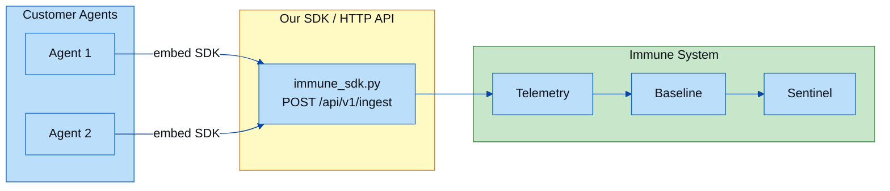
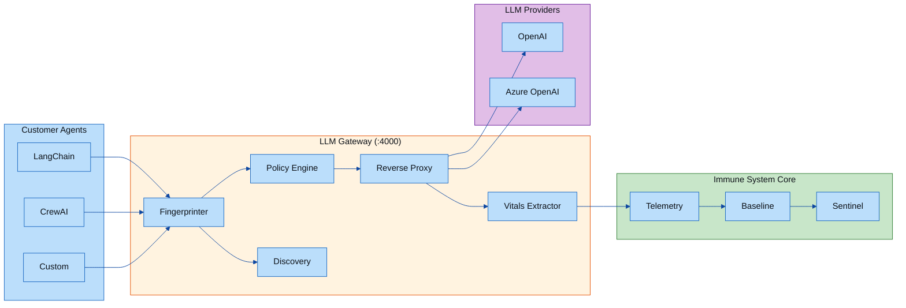
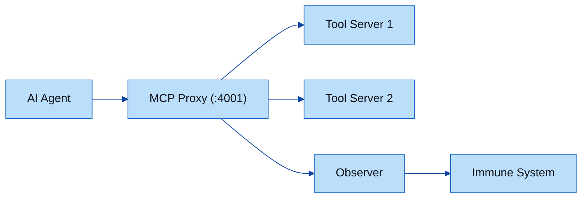
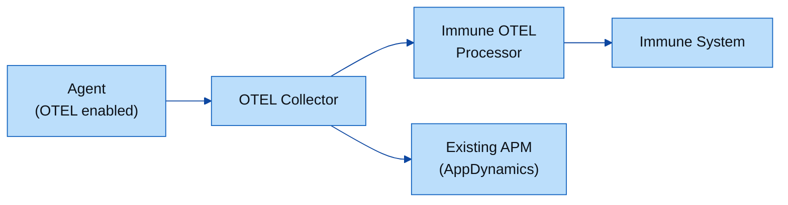
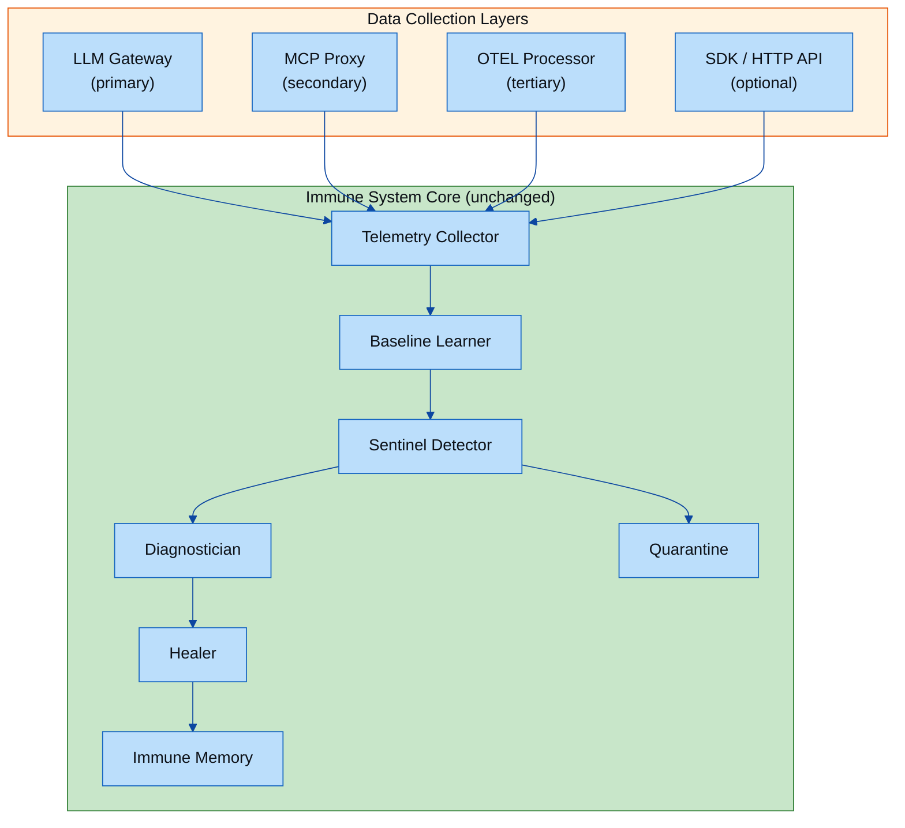
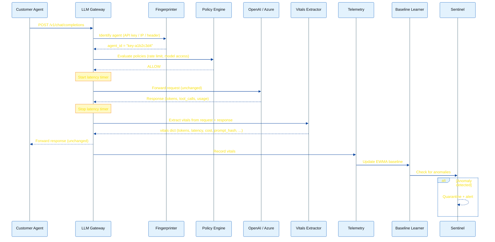

# Architecture Decision: Passive Agent Observation via LLM Gateway

> **Status:** Accepted  
> **Date:** February 2026  
> **Decision makers:** AI Agent Immune System team  
> **Scope:** How the immune system collects agent telemetry in production environments where customer agents are not under our control.

---

## 1. Problem Statement

The AI Agent Immune System detects anomalies in AI agent behavior (token spikes, latency spikes, tool-call loops, prompt drift, cost overruns) by comparing real-time vitals against learned baselines. The core detection, quarantine, and healing logic works well.

**The critical gap:** How do we collect vitals from customer AI agents?

In a real deployment, the agents are:
- **Not under our control** — customers use LangChain, CrewAI, AutoGen, Semantic Kernel, custom frameworks, or vendor-specific platforms.
- **Not modifiable** — we cannot ask every customer to instrument every agent with our SDK.
- **Diverse** — agents run in different languages, runtimes, and infrastructure (Kubernetes, VMs, serverless).
- **Sometimes unknown** — shadow AI / rogue agents may exist that no one has catalogued.

The whole value of an "immune system" is detecting threats that agents themselves are unaware of. Requiring agents to voluntarily report is like asking a virus to report itself.

---

## 2. Options Explored

We evaluated five approaches. Each represents a different tradeoff between deployment friction, coverage, and depth of observation.

### Option A: Push-based SDK / HTTP API (original approach)

Agents embed our Python SDK (`immune_sdk.py`) or call `POST /api/v1/ingest` after each LLM interaction.



| Pros | Cons |
|------|------|
| Richest data — agent controls exactly what is reported | Requires code changes in every agent |
| Agent can add custom metadata (task_id, conversation_id) | Cannot observe agents we don't control |
| Works in any language (HTTP API) | Shadow/rogue agents won't voluntarily report |
| Already implemented and tested | Adoption barrier: customers must instrument each agent |
| | Agent could lie or omit data |

**Verdict:** Good for cooperative agents, but fails the core requirement of observing agents we don't control.

### Option B: LLM Gateway / Reverse Proxy (chosen approach)

A reverse proxy sits between agents and their LLM providers. Agents point their `OPENAI_BASE_URL` at the gateway — one env-var change, no code change.



| Pros | Cons |
|------|------|
| Zero agent code changes — one env-var change | Must route LLM traffic through gateway (infra change) |
| Observes ALL agents including shadow/unknown | Single point of failure if not deployed with HA |
| Cannot be bypassed by agents | Adds a few ms of latency (reverse proxy hop) |
| Auto-discovers new agents | Cannot see agent-internal state (memory, task context) |
| Policy enforcement at the chokepoint | Encrypted direct connections bypass the proxy |
| Cost tracking, rate limiting, model governance | |
| Works with any framework / language |  |

**Verdict:** Best overall balance of coverage, deployment simplicity, and enforcement capability.

### Option C: MCP Protocol Middleware

An HTTP/SSE proxy between MCP clients and MCP servers, observing `tools/call` JSON-RPC messages.



| Pros | Cons |
|------|------|
| Deep visibility into tool usage patterns | Only captures tool calls, not LLM interactions |
| MCP is becoming a standard protocol | Not all agents use MCP yet |
| Captures tool latency, errors, arguments | Requires MCP server routing change |

**Verdict:** Excellent supplement to the LLM gateway, not a standalone solution.

### Option D: OpenTelemetry Span Processing

Hook into existing OTEL trace pipelines that agent frameworks (LangChain, LlamaIndex, OpenLLMetry) already emit.



| Pros | Cons |
|------|------|
| Zero agent changes if OTEL already enabled | Not all agents emit OTEL traces |
| Leverages existing observability investment | Less control over what is captured |
| Integrates with AppDynamics / Datadog / etc. | `gen_ai.*` semantic conventions still evolving |
| Rich span context (parent chains, resources) | Requires OTEL SDK in the agent runtime |

**Verdict:** Good tertiary data source; not reliable as the primary collection method.

### Option E: Network-level Observation (eBPF / Service Mesh)

Capture HTTP traffic at the kernel or sidecar level without any application changes.

| Pros | Cons |
|------|------|
| Truly zero-touch — no app changes at all | TLS encryption prevents content inspection without termination |
| Captures all network traffic | Complex deployment (eBPF, Istio, Linkerd) |
| Works for any protocol | Less semantic understanding of LLM-specific data |
|  | Cannot parse streaming SSE or multi-part responses easily |

**Verdict:** Too complex and too limited in semantic understanding for our use case.

---

## 3. Decision

**We chose a layered approach with the LLM Gateway (Option B) as the primary collection method:**

| Layer | Component | Role |
|-------|-----------|------|
| **Primary** | LLM Gateway (`gateway/proxy.py`) | Intercepts all LLM traffic; extracts vitals passively |
| **Secondary** | MCP Proxy (`gateway/mcp_proxy.py`) | Observes tool-call patterns |
| **Tertiary** | OTEL Processor (`gateway/otel_processor.py`) | Enriches with framework-level trace data |
| **Optional** | SDK (`immune_sdk.py`) | Cooperative agents can add custom metadata |



The immune system core (EWMA baselines, deviation detection, quarantine, healing, immune memory) remains **completely unchanged**. Only the data collection layer was added.

---

## 4. How We Arrived at This Decision

### 4.1 The Universal Chokepoint Insight

Every AI agent — regardless of framework, language, or infrastructure — **must** call an LLM API to function. This is the one universal chokepoint. If we position ourselves at this boundary, we observe every agent without requiring any cooperation.

This is the same principle that firewalls use (all traffic must pass through the network boundary) and that API gateways use (all API calls must pass through the gateway).

### 4.2 Industry Validation

Our approach aligns with emerging industry patterns:

- **[LangGuard AI Control Plane](https://langguard.ai):** Demonstrates that governance must live "outside the agent's execution loop" (Forrester). Their Discover → Provision → Monitor lifecycle works without agent code changes.
- **Gartner AI TRiSM:** Predicts 80% of unauthorized AI transactions stem from internal policy violations, not external attacks. The gateway catches both.
- **Forrester Agent Control Plane:** Argues oversight must sit outside the agent to remain effective even when agents behave unpredictably.
- **IDC Next-Gen AI Control Plane:** Envisions real-time policy enforcement, not just dashboards.

### 4.3 Deployment Simplicity

The gateway requires exactly **one change** from the customer:

```bash
export OPENAI_BASE_URL=http://gateway:4000/v1
```

Compare this to the SDK approach, which requires code changes in every agent, testing, deployment, and ongoing maintenance of the SDK integration.

### 4.4 Cisco / AppDynamics Synergy

This architecture aligns with Cisco's portfolio:
- **AppDynamics** already instruments runtimes — can auto-detect agent processes.
- **ThousandEyes** provides network-level visibility into gateway health.
- **Cisco Secure Access** can enforce proxy routing at the network level, preventing agents from bypassing the gateway.
- The gateway becomes a specialized **AI-aware proxy** that plugs into the existing observability stack.

---

## 5. Tradeoffs Acknowledged

| Tradeoff | Mitigation |
|----------|------------|
| **Latency:** Proxy adds a few ms per request | Gateway is lightweight (< 5 ms overhead); deployed close to agents in the same network |
| **Single point of failure** | Deploy gateway as a replicated service behind a load balancer; health checks ensure failover |
| **Direct connections bypass** | Enterprise network policy (Cisco Secure Access) can enforce all LLM traffic routes through the gateway |
| **No agent-internal state** | SDK remains available as optional enrichment for agents that want to share context, memory, or task IDs |
| **Streaming complexity** | Gateway handles SSE streams, injecting `stream_options.include_usage` to ensure usage data in final chunks |
| **Provider-specific formats** | Gateway supports OpenAI-compatible API format, which Azure OpenAI, vLLM, LiteLLM, and Ollama also use |

---

## 6. What Makes This the Best Approach for Customers

### 6.1 Zero friction adoption

Customers do not need to modify a single line of agent code. They set one environment variable and immediately get:
- Auto-discovery of all agents using LLMs
- Per-agent behavioral baselines (EWMA)
- Anomaly detection (9 anomaly types)
- Rate limiting and model governance
- Cost tracking per agent

### 6.2 Observes what customers cannot control

Shadow AI, third-party agents, and rogue processes all become visible the moment they make an LLM call through the gateway. Customers gain visibility into agents they didn't even know existed.

### 6.3 Defense in depth

The layered approach (gateway + MCP + OTEL + SDK) means customers can start with the gateway alone and add deeper observation as needed. Each layer adds coverage without requiring changes to the others.

### 6.4 Policy enforcement at the chokepoint

The gateway doesn't just observe — it can **act**:
- Block agents from using expensive models
- Rate-limit runaway agents
- Alert on anomalous patterns
- Enforce token budgets per team/agent

This transforms the immune system from a monitoring tool into a governance platform.

### 6.5 Works with any AI stack

Because the gateway proxies the standard OpenAI API format (which has become the de facto standard for LLM APIs), it works with:
- OpenAI (GPT-4, GPT-4o, o1, o3)
- Azure OpenAI
- Anthropic (via OpenAI-compatible proxy like LiteLLM)
- Google Gemini (via compatible endpoints)
- Self-hosted models (vLLM, Ollama, TGI)
- Any framework: LangChain, CrewAI, AutoGen, LlamaIndex, Semantic Kernel, or custom

---

## 7. Complete Data Flow

This diagram shows the end-to-end flow from customer agent to detection:



---

## 8. Vitals Mapping: How Each Metric Is Captured

Every vital that the immune system tracks can be extracted passively from the LLM request/response pair:

| Vital | Where It Comes From | Accuracy |
|-------|---------------------|----------|
| `input_tokens` | Response `usage.prompt_tokens` | Exact (from LLM provider) |
| `output_tokens` | Response `usage.completion_tokens` | Exact |
| `latency_ms` | Gateway-measured round-trip time | Exact (includes network to LLM) |
| `tool_calls` | Count of `tool_calls` array in response | Exact |
| `model` | Request body `model` field or response | Exact |
| `success` | HTTP status code (2xx = true) | Exact |
| `error_type` | Error response `error.type` | Exact |
| `cost` | Computed from model pricing table + tokens | Approximate (pricing may differ) |
| `retries` | Detected via repeated identical request hashes | Heuristic |
| `prompt_hash` | SHA-256 of system message content from request | Exact for prompt drift detection |
| `agent_id` | Fingerprinted from API key, IP, or custom header | Stable (deterministic hash) |

---

## 9. References

- [LangGuard: What is an AI Control Plane](https://langguard.ai/2026/02/04/what-is-an-ai-control-plane) — Industry analysis of the AI governance gap
- Gartner AI TRiSM Framework — Trust, Risk, and Security Management for AI
- Forrester: Agent Control Plane — Governance outside the agent execution loop
- IDC: Next-Gen AI Control Plane — Dynamic policy enforcement for AI workloads
- [OpenAI API Reference](https://platform.openai.com/docs/api-reference) — Chat completions request/response format
- [OpenTelemetry gen_ai Semantic Conventions](https://opentelemetry.io/docs/specs/semconv/gen-ai/) — Standard span attributes for LLM calls
